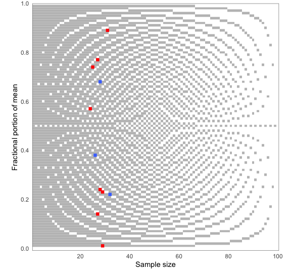
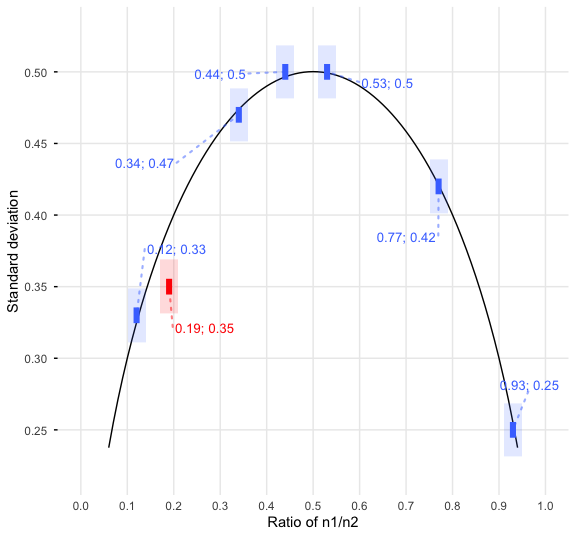

<!-- README.md is generated from README.Rmd. Please edit that file -->

<!-- Knit with devtools::build_readme(), not rmarkdown::render() or the -->

<!-- "Knit" button -- those load the installed package, not the current -->

<!-- source, and can silently render stale/incorrect output. -->

<!-- badges: start -->

[](https://github.com/lhdjung/scrutiny/actions/workflows/R-CMD-check.yaml)
[](https://app.codecov.io/gh/lhdjung/scrutiny?branch=main)

<!-- badges: end -->

# scrutiny: Error detection in science

The goal of scrutiny is to test published summary statistics for
consistency using techniques like GRIM and to check their plausibility.
The package makes these methods easy to use in a tidyverse-friendly way.
It hopes to help the new field of error detection go mainstream.

You can use the most important parts in the [Error
detection](https://errors.shinyapps.io/scrutiny) Shiny app instead.

Besides ready-made tests, scrutiny features a complete system for
implementing new consistency tests. It also has duplication analysis,
more general infrastructure for implementing error detection techniques,
as well as specialized data wrangling functions. See the *Articles* tab
for vignettes.

Install the package from CRAN:

``` r
install.packages("scrutiny")
```

Alternatively, install the development version from GitHub:

``` r
remotes::install_github("lhdjung/scrutiny")
```

## Get started

Here is how to GRIM-test all values in a data frame. When using
`grim_map()`, the `consistency` column tells you if the means (`x`) and
sample sizes (`n`) are mutually consistent.

``` r
library(scrutiny)

# Example data:
pigs1
#> # A tibble: 12 × 2
#>        x     n
#>    <dbl> <dbl>
#>  1  7.22    32
#>  2  4.74    25
#>  3  5.23    29
#>  4  2.57    24
#>  5  6.77    27
#>  6  2.68    28
#>  7  7.01    29
#>  8  7.38    26
#>  9  3.14    27
#> 10  6.89    31
#> 11  5       25
#> 12  0.24    28

# GRIM-testing for data frames:
grim_map(pigs1, digits_x = 2)
#> # A tibble: 12 × 5
#>        x     n digits_x consistency probability
#>    <dbl> <dbl>    <dbl> <lgl>             <dbl>
#>  1  7.22    32        2 TRUE               0.68
#>  2  4.74    25        2 FALSE              0.75
#>  3  5.23    29        2 FALSE              0.71
#>  4  2.57    24        2 FALSE              0.76
#>  5  6.77    27        2 FALSE              0.73
#>  6  2.68    28        2 TRUE               0.72
#>  7  7.01    29        2 FALSE              0.71
#>  8  7.38    26        2 TRUE               0.74
#>  9  3.14    27        2 FALSE              0.73
#> 10  6.89    31        2 FALSE              0.69
#> 11  5       25        2 TRUE               0.75
#> 12  0.24    28        2 FALSE              0.72
```

Test percentages instead of means:

``` r
pigs2
#> # A tibble: 6 × 2
#>       x     n
#>   <dbl> <dbl>
#> 1  67.4   150
#> 2  54.2   150
#> 3  54     150
#> 4  69.8   150
#> 5  68.1   150
#> 6  55.4   150

grim_map(pigs2, digits_x = 2, percent = TRUE)
#> ℹ `x` converted from percentage
#> # A tibble: 6 × 5
#>       x     n digits_x consistency probability
#>   <dbl> <dbl>    <dbl> <lgl>             <dbl>
#> 1  67.4   150        2 FALSE             0.985
#> 2  54.2   150        2 FALSE             0.985
#> 3  54     150        2 TRUE              0.985
#> 4  69.8   150        2 FALSE             0.985
#> 5  68.1   150        2 FALSE             0.985
#> 6  55.4   150        2 FALSE             0.985
```

You can choose how the means are reconstructed for testing — below,
rounded up from 5. When visualizing results, the plot will adjust
automatically. Blue dots are consistent values, red dots are
inconsistent ones:

``` r
pigs1 |>
  grim_map(rounding = "up", digits_x = 2) |>
  grim_plot()
```



Similarly, use DEBIT to test means and standard deviations of binary
data:

``` r
pigs3
#> # A tibble: 7 × 3
#>       x    sd     n
#>   <dbl> <dbl> <dbl>
#> 1  0.53  0.5   1683
#> 2  0.44  0.5   1683
#> 3  0.77  0.42  1683
#> 4  0.19  0.35  1683
#> 5  0.34  0.47  1683
#> 6  0.93  0.25  1683
#> 7  0.12  0.33  1683

pigs3 |>
  debit_map(digits_x = 2, digits_sd = 2)
#> # A tibble: 7 × 13
#>       x    sd     n digits_x digits_sd consistency rounding   sd_lower
#>   <dbl> <dbl> <int>    <dbl>     <dbl> <lgl>       <chr>         <dbl>
#> 1  0.53  0.5   1683        2         2 TRUE        up_or_down    0.495
#> 2  0.44  0.5   1683        2         2 TRUE        up_or_down    0.495
#> 3  0.77  0.42  1683        2         2 TRUE        up_or_down    0.415
#> 4  0.19  0.35  1683        2         2 FALSE       up_or_down    0.345
#> 5  0.34  0.47  1683        2         2 TRUE        up_or_down    0.465
#> 6  0.93  0.25  1683        2         2 TRUE        up_or_down    0.245
#> 7  0.12  0.33  1683        2         2 TRUE        up_or_down    0.325
#> # ℹ 5 more variables: sd_incl_lower <lgl>, sd_upper <dbl>, sd_incl_upper <lgl>,
#> #   x_lower <dbl>, x_upper <dbl>

pigs3 |>
  debit_map(digits_x = 2, digits_sd = 2) |>
  debit_plot()
```



## Guiding ideas

> (…) a critical inspection of the published literature should not be
> mischaracterized as a hobby for the overly cynical, nor as so-called
> “methodological terrorism”. On the contrary, carefully evaluating
> presented data is a cornerstone of scientific investigation, and it is
> only logical to apply this also to the published literature. If we are
> not willing to critically assess published studies, we also cannot
> guarantee their veracity.

— van der Zee et al. (2017, pp. 8-9)

> (…) [data
> thugs](https://jamesheathers.medium.com/hugs-shrugs-and-data-thugs-663858757c4a)
> (…) demand data and if they do not receive it, they contact editors
> and universities and threaten to write blogs and tweets about the
> errors uncovered.

— Eric A. Stewart (six retractions; quoted in Pickett 2020, p. 178)

# References

Pickett, J. T. (2020). The Stewart Retractions: A Quantitative and
Qualitative Analysis. *Econ Journal Watch*, *17*(1), 152–190.
<https://econjwatch.org/articles/the-stewart-retractions-a-quantitative-and-qualitative-analysis>.

van der Zee, T., Anaya, J., & Brown, N. J. L. (2017). Statistical
heartburn: An attempt to digest four pizza publications from the Cornell
Food and Brand Lab. *BMC Nutrition*, *3*(1), 54.
<https://doi.org/10.1186/s40795-017-0167-x>.
