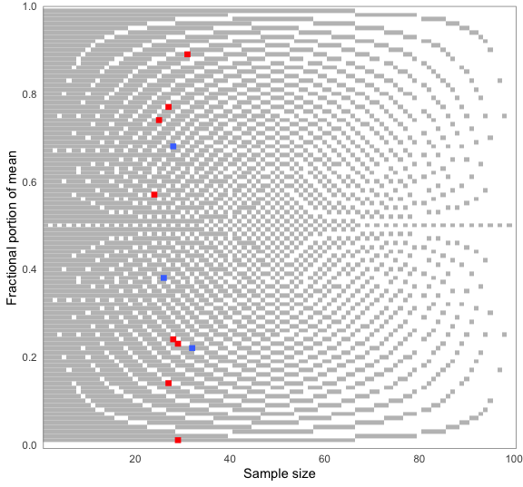

<!-- README.md is generated from README.Rmd. Please edit that file -->
<!-- badges: start -->

<!-- badges: end -->

# Error detection in science

The goal of scrutiny is to test published summary statistics for
consistency and reconstruct some of the processes which created them.
The package makes these methods easy to use in a tidyverse-friendly way.
It hopes to help the new field of error detection go mainstream.

Besides consistency tests, scrutiny features infrastructure for
implementing error detection techniques, as well as specialized data
wrangling functions. See the *Articles* tab for vignettes.

scrutiny is a work in progress. You are welcome to contribute with pull
requests. However, please [open an
issue](https://github.com/lhdjung/scrutiny/issues) first.

The package is not on CRAN yet. You can install in from GitHub like
this:

    remotes::install_github("lhdjung/scrutiny")

## Get started

Here is how to GRIM-test all values in a data frame. When using
`grim_map()`, the `consistency` column tells you if the means (`x`),
sample sizes (`n`), and numbers of scale items are mutually consistent.
Scale item numbers are 1 by default.

    library(scrutiny)

    # Example data:
    pigs1
    #> # A tibble: 12 × 2
    #>    x         n
    #>    <chr> <dbl>
    #>  1 7.22     32
    #>  2 4.74     25
    #>  3 5.23     29
    #>  4 2.57     24
    #>  5 6.77     27
    #>  6 2.68     28
    #>  7 7.01     29
    #>  8 7.38     26
    #>  9 3.14     27
    #> 10 6.89     31
    #> 11 5.00     25
    #> 12 0.24     28

    # GRIM-testing for data frames:
    grim_map(pigs1)
    #> # A tibble: 12 × 5
    #>    x         n items consistency ratio
    #>    <chr> <int> <int> <lgl>       <dbl>
    #>  1 7.22     32     1 TRUE         0.68
    #>  2 4.74     25     1 FALSE        0.75
    #>  3 5.23     29     1 FALSE        0.71
    #>  4 2.57     24     1 FALSE        0.76
    #>  5 6.77     27     1 FALSE        0.73
    #>  6 2.68     28     1 TRUE         0.72
    #>  7 7.01     29     1 FALSE        0.71
    #>  8 7.38     26     1 TRUE         0.74
    #>  9 3.14     27     1 FALSE        0.73
    #> 10 6.89     31     1 FALSE        0.69
    #> 11 5.00     25     1 TRUE         0.75
    #> 12 0.24     28     1 FALSE        0.72

Test percentages instead of means:

    pigs2
    #> # A tibble: 6 × 2
    #>   x         n
    #>   <chr> <dbl>
    #> 1 67.4    150
    #> 2 54.2    150
    #> 3 54.0    150
    #> 4 69.8    150
    #> 5 68.1    150
    #> 6 55.4    150

    grim_map(pigs2, percent = TRUE)
    #> ℹ `x` converted from percentage
    #> # A tibble: 6 × 5
    #>   x         n items consistency ratio
    #>   <chr> <int> <int> <lgl>       <dbl>
    #> 1 0.674   150     1 FALSE        0.85
    #> 2 0.542   150     1 FALSE        0.85
    #> 3 0.540   150     1 TRUE         0.85
    #> 4 0.698   150     1 FALSE        0.85
    #> 5 0.681   150     1 FALSE        0.85
    #> 6 0.554   150     1 FALSE        0.85

You can visualize GRIM results while also choosing how the means are
reconstructed. Blue dots are consistent values, red dots are
inconsistent ones:

    pigs1 %>% 
      grim_map(rounding = "up") %>% 
      grim_plot()

Similarly, use DEBIT to test means and standard deviations of binary
data:

    pigs3
    #> # A tibble: 7 × 3
    #>   x     sd        n
    #>   <chr> <chr> <dbl>
    #> 1 0.53  0.50   1683
    #> 2 0.44  0.50   1683
    #> 3 0.77  0.42   1683
    #> 4 0.19  0.35   1683
    #> 5 0.34  0.47   1683
    #> 6 0.93  0.25   1683
    #> 7 0.12  0.33   1683

    pigs3 %>% 
      debit_map()
    #> # A tibble: 7 × 11
    #>   x     sd        n consistency rounding   sd_lower sd_incl_lower sd_upper
    #>   <chr> <chr> <int> <lgl>       <chr>         <dbl> <lgl>            <dbl>
    #> 1 0.53  0.50   1683 TRUE        up_or_down    0.495 TRUE             0.505
    #> 2 0.44  0.50   1683 TRUE        up_or_down    0.495 TRUE             0.505
    #> 3 0.77  0.42   1683 TRUE        up_or_down    0.415 TRUE             0.425
    #> 4 0.19  0.35   1683 FALSE       up_or_down    0.345 TRUE             0.355
    #> 5 0.34  0.47   1683 TRUE        up_or_down    0.465 TRUE             0.475
    #> 6 0.93  0.25   1683 TRUE        up_or_down    0.245 TRUE             0.255
    #> 7 0.12  0.33   1683 TRUE        up_or_down    0.325 TRUE             0.335
    #> # … with 3 more variables: sd_incl_upper <lgl>, x_lower <dbl>, x_upper <dbl>

    pigs3 %>% 
      debit_map() %>% 
      debit_plot()

## Guiding ideas

> (…) a critical inspection of the published literature should not be
> mischaracterized as a hobby for the overly cynical, nor as so-called
> “methodological terrorism”. On the contrary, carefully evaluating
> presented data is a cornerstone of scientific investigation, and it is
> only logical to apply this also to the published literature. If we are
> not willing to critically assess published studies, we also cannot
> guarantee their veracity.

— van der Zee et al. (2017, pp. 8-9)

> (…) [data
> thugs](https://jamesheathers.medium.com/hugs-shrugs-and-data-thugs-663858757c4a)
> (…) demand data and if they do not receive it, they contact editors
> and universities and threaten to write blogs and tweets about the
> errors uncovered.

— Eric A. Stewart (six retractions; quoted in Pickett 2020, p. 178)

# References

Pickett, Justin T. „The Stewart Retractions: A Quantitative and
Qualitative Analysis". *Econ Journal Watch* 17, Nr. 1 (March 2020):
152–90. URL:
<https://econjwatch.org/articles/the-stewart-retractions-a-quantitative-and-qualitative-analysis>.

van der Zee, Tim, Jordan Anaya, und Nicholas J. L. Brown. „Statistical
Heartburn: An Attempt to Digest Four Pizza Publications from the Cornell
Food and Brand Lab". *BMC Nutrition* 3, Nr. 1 (Dezember 2017): 54.
<https://doi.org/10.1186/s40795-017-0167-x>.
