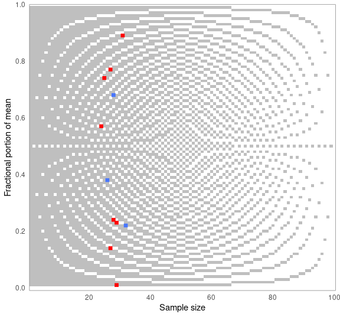
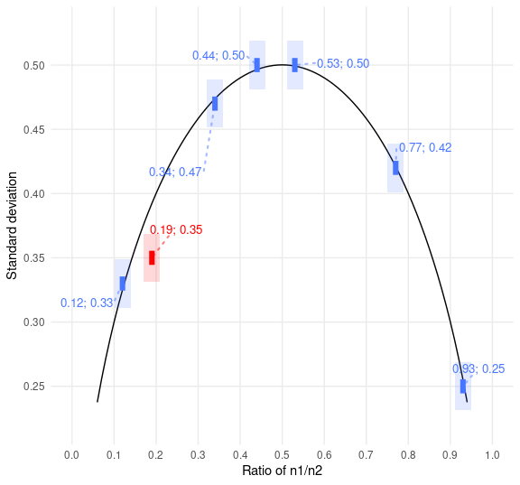

<!-- README.md is generated from README.Rmd. Please edit that file -->
<!-- badges: start -->

<!-- badges: end -->

# Error detection in science

The goal of scrutiny is to test published summary statistics for
consistency using techniques like GRIM and to check their plausibility
by reconstructing some of the processes behind them. The package makes
these methods easy to use in a tidyverse-friendly way. It hopes to help
the new field of error detection go mainstream.

Besides ready-made tests, scrutiny features a complete system for
implementing new consistency tests, more general infrastructure for
implementing error detection techniques, as well as specialized data
wrangling functions. See the *Articles* tab for vignettes.

scrutiny is a work in progress. You are welcome to contribute with pull
requests. However, please [open an
issue](https://github.com/lhdjung/scrutiny/issues) first.

Install the package from CRAN:

    install.packages("scrutiny")

Alternatively, install the development version from GitHub:

    remotes::install_github("lhdjung/scrutiny")

## Get started

Here is how to GRIM-test all values in a data frame. When using
`grim_map()`, the `consistency` column tells you if the means (`x`),
sample sizes (`n`), and numbers of scale items are mutually consistent.
Scale item numbers are 1 by default.

    library(scrutiny)

    # Example data:
    pigs1
    #> # A tibble: 12 × 2
    #>    x         n
    #>    <chr> <dbl>
    #>  1 7.22     32
    #>  2 4.74     25
    #>  3 5.23     29
    #>  4 2.57     24
    #>  5 6.77     27
    #>  6 2.68     28
    #>  7 7.01     29
    #>  8 7.38     26
    #>  9 3.14     27
    #> 10 6.89     31
    #> 11 5.00     25
    #> 12 0.24     28

    # GRIM-testing for data frames:
    grim_map(pigs1)
    #> # A tibble: 12 × 4
    #>    x         n consistency ratio
    #>    <chr> <dbl> <lgl>       <dbl>
    #>  1 7.22     32 TRUE         0.68
    #>  2 4.74     25 FALSE        0.75
    #>  3 5.23     29 FALSE        0.71
    #>  4 2.57     24 FALSE        0.76
    #>  5 6.77     27 FALSE        0.73
    #>  6 2.68     28 TRUE         0.72
    #>  7 7.01     29 FALSE        0.71
    #>  8 7.38     26 TRUE         0.74
    #>  9 3.14     27 FALSE        0.73
    #> 10 6.89     31 FALSE        0.69
    #> 11 5.00     25 TRUE         0.75
    #> 12 0.24     28 FALSE        0.72

Test percentages instead of means:

    pigs2
    #> # A tibble: 6 × 2
    #>   x         n
    #>   <chr> <dbl>
    #> 1 67.4    150
    #> 2 54.2    150
    #> 3 54.0    150
    #> 4 69.8    150
    #> 5 68.1    150
    #> 6 55.4    150

    grim_map(pigs2, percent = TRUE)
    #> ℹ `x` converted from percentage
    #> # A tibble: 6 × 4
    #>   x         n consistency ratio
    #>   <chr> <dbl> <lgl>       <dbl>
    #> 1 0.674   150 FALSE        0.85
    #> 2 0.542   150 FALSE        0.85
    #> 3 0.540   150 TRUE         0.85
    #> 4 0.698   150 FALSE        0.85
    #> 5 0.681   150 FALSE        0.85
    #> 6 0.554   150 FALSE        0.85

You can choose how the means are reconstructed for testing — below,
rounded up from 5. When visualizing results, the plot will adjust
automatically. Blue dots are consistent values, red dots are
inconsistent ones:

    pigs1 %>% 
      grim_map(rounding = "up") %>% 
      grim_plot()

Similarly, use DEBIT to test means and standard deviations of binary
data:

    pigs3
    #> # A tibble: 7 × 3
    #>   x     sd        n
    #>   <chr> <chr> <dbl>
    #> 1 0.53  0.50   1683
    #> 2 0.44  0.50   1683
    #> 3 0.77  0.42   1683
    #> 4 0.19  0.35   1683
    #> 5 0.34  0.47   1683
    #> 6 0.93  0.25   1683
    #> 7 0.12  0.33   1683

    pigs3 %>% 
      debit_map()
    #> # A tibble: 7 × 11
    #>   x     sd        n consistency rounding sd_lo…¹ sd_in…² sd_up…³ sd_in…⁴ x_lower
    #>   <chr> <chr> <int> <lgl>       <chr>      <dbl> <lgl>     <dbl> <lgl>     <dbl>
    #> 1 0.53  0.50   1683 TRUE        up_or_d…   0.495 TRUE      0.505 TRUE      0.525
    #> 2 0.44  0.50   1683 TRUE        up_or_d…   0.495 TRUE      0.505 TRUE      0.435
    #> 3 0.77  0.42   1683 TRUE        up_or_d…   0.415 TRUE      0.425 TRUE      0.765
    #> 4 0.19  0.35   1683 FALSE       up_or_d…   0.345 TRUE      0.355 TRUE      0.185
    #> 5 0.34  0.47   1683 TRUE        up_or_d…   0.465 TRUE      0.475 TRUE      0.335
    #> 6 0.93  0.25   1683 TRUE        up_or_d…   0.245 TRUE      0.255 TRUE      0.925
    #> 7 0.12  0.33   1683 TRUE        up_or_d…   0.325 TRUE      0.335 TRUE      0.115
    #> # … with 1 more variable: x_upper <dbl>, and abbreviated variable names
    #> #   ¹​sd_lower, ²​sd_incl_lower, ³​sd_upper, ⁴​sd_incl_upper

    pigs3 %>% 
      debit_map() %>% 
      debit_plot()

## Guiding ideas

> (…) a critical inspection of the published literature should not be
> mischaracterized as a hobby for the overly cynical, nor as so-called
> “methodological terrorism”. On the contrary, carefully evaluating
> presented data is a cornerstone of scientific investigation, and it is
> only logical to apply this also to the published literature. If we are
> not willing to critically assess published studies, we also cannot
> guarantee their veracity.

— van der Zee et al. (2017, pp. 8-9)

> (…) [data
> thugs](https://jamesheathers.medium.com/hugs-shrugs-and-data-thugs-663858757c4a)
> (…) demand data and if they do not receive it, they contact editors
> and universities and threaten to write blogs and tweets about the
> errors uncovered.

— Eric A. Stewart (six retractions; quoted in Pickett 2020, p. 178)

# References

Pickett, J. T. (2020). The Stewart Retractions: A Quantitative and
Qualitative Analysis. *Econ Journal Watch*, *17*(1), 152–190.
<https://econjwatch.org/articles/the-stewart-retractions-a-quantitative-and-qualitative-analysis>.

van der Zee, T., Anaya, J., & Brown, N. J. L. (2017). Statistical
heartburn: An attempt to digest four pizza publications from the Cornell
Food and Brand Lab. *BMC Nutrition*, *3*(1), 54.
<https://doi.org/10.1186/s40795-017-0167-x>.
