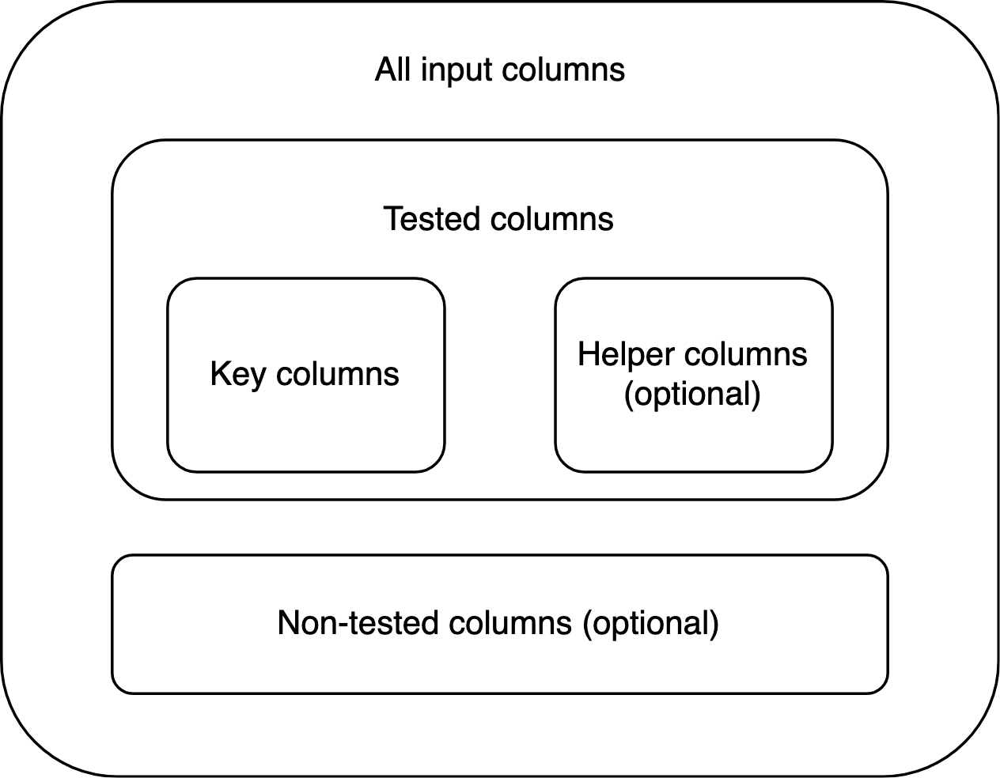
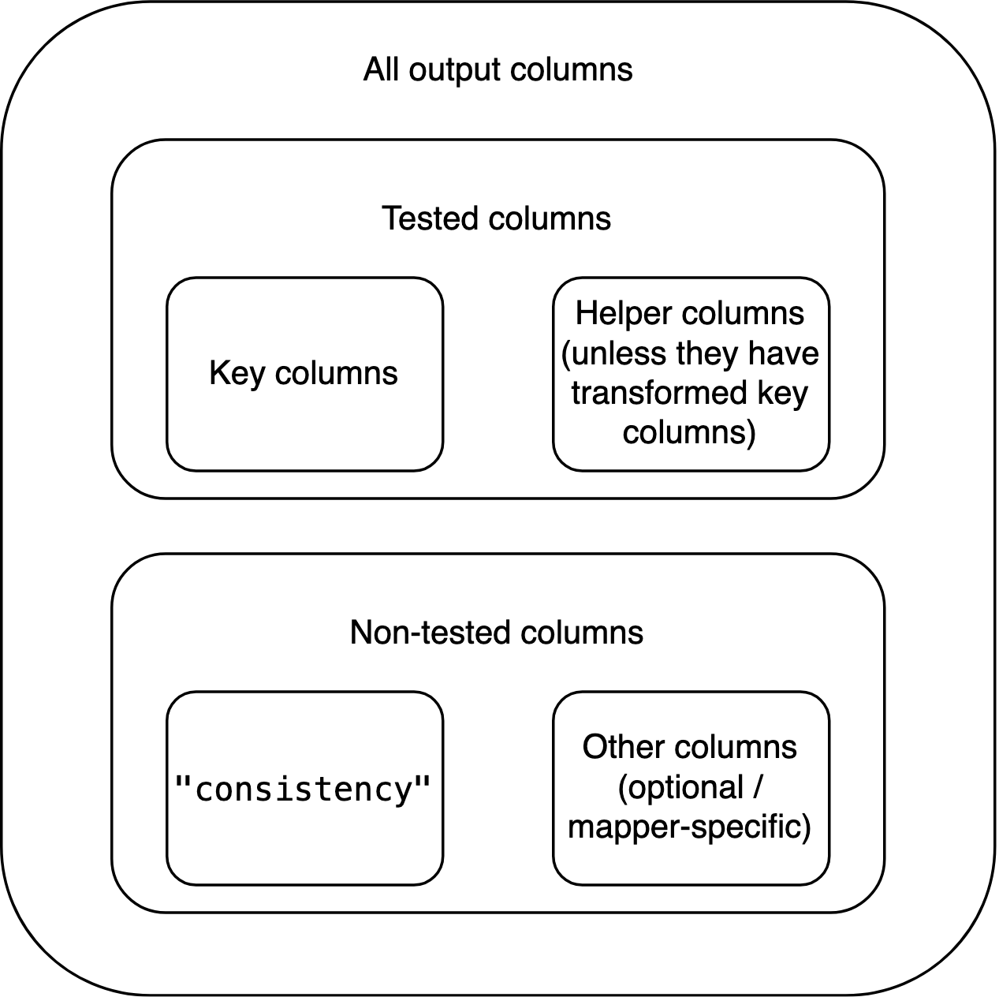

# Consistency tests in depth

``` r
library(scrutiny)
```

## Introduction

When implementing consistency tests in R, you shouldn’t have to start
from zero. This vignette goes into detail on scrutiny’s support system
for writing new consistency testing functions. For a brief presentation,
see
[`vignette("consistency-tests-simple")`](https://lhdjung.github.io/scrutiny/articles/consistency-tests-simple.md).

Following the present vignette will dramatically simplify the
implementation of basic and advanced testing routines via function
factories. It will enable you to write entire families of functions in a
streamlined way: If you are familiar with any one scrutiny-style
consistency test, you will immediately be able to make some sense of the
other ones. This is true across all levels of consistency testing.

Below is an outline of these levels, and of the vignette, with GRIM as a
paradigmatic example. If a valid consistency test is newly implemented
with at least the first step, I’ll be happy to accept a pull request to
scrutiny. This means you’ll only have to implement the core test itself,
without even reading the vignette any further.

1.  A bare-bones, non-exported (!) function for testing a single set of
    cases, such as `grim_scalar()`.

2.  A vectorized version of the single-case function, such as
    [`grim()`](https://lhdjung.github.io/scrutiny/reference/grim.md).

3.  A specialized mapping function that applies the single-case function
    to a data frame, such as
    [`grim_map()`](https://lhdjung.github.io/scrutiny/reference/grim_map.md).

4.  A method for the
    [`audit()`](https://lhdjung.github.io/scrutiny/reference/audit.md)
    generic that summarizes the results of number 3.

5.  A visualization function that plots the results of number 3, such as
    [`grim_plot()`](https://lhdjung.github.io/scrutiny/reference/grim_plot.md).

6.  A mapping function that checks if slightly varied input values are
    consistent with the respective other reported values, such as
    [`grim_map_seq()`](https://lhdjung.github.io/scrutiny/reference/grim_map_seq.md).

7.  A mapping function to be used if only the total sample size was
    reported (in a study with two groups), not the individual group
    sizes, such as
    [`grim_map_total_n()`](https://lhdjung.github.io/scrutiny/reference/grim_map_total_n.md).

8.  [`audit_seq()`](https://lhdjung.github.io/scrutiny/reference/audit-special.md)
    and
    [`audit_total_n()`](https://lhdjung.github.io/scrutiny/reference/audit-special.md)
    already work with the output of numbers 6 and 7, respectively. They
    still have to be specifically documented.

I will use a toy test called SCHLIM as a model to demonstrate the
minimal steps needed to implement consistency tests, scrutiny-style.
Note that SCHLIM doesn’t have any significance beyond standing in for
serious consistency tests. Any real implementation might well be more
complex than the brief code snippets below. I will also recur to
existing functions that implement actual tests, and that the reader may
be familiar with.

Please make sure to follow the [tidyverse style
guide](https://style.tidyverse.org/) as well as the scrutiny-specific
conventions laid out below, wherever applicable. If you’d like to write
a new package, work with the free online book [*R
Packages*](https://r-pkgs.org/) (Wickham and Bryan 2023).

## 1. Single-case

The first function is the most important one. It contains the core
implementation of the test. Although it is not exported itself, all
other steps build up on it, and all of them are exported.

This function takes two or more arguments of length 1 that are meant to
be tested for consistency with each other. Typically, they will be
coercible to numeric. This means they either are numeric themselves or
they are strings that can be converted to numbers (see
[`is_numeric_like()`](https://lhdjung.github.io/scrutiny/reference/is_numeric_like.md)).
The function returns a logical value of length 1: It’s `TRUE` if the
inputs are mutually consistent, and `FALSE` if they aren’t.

``` r
 schlim_scalar <- function(y, n) {
   y <- as.numeric(y)
   n <- as.numeric(n)
   all(y / 3 > n)
 }

schlim_scalar(y = 30, n = 4)
#> [1] TRUE
schlim_scalar(y = 2, n = 7)
#> [1] FALSE
```

Other arguments might still be necessary, especially if your function
reconstructs rounded numbers. An argument that determines how the
function will round numbers should be called `rounding`. The function
should then internally call
[`reround()`](https://lhdjung.github.io/scrutiny/reference/reround.md).
The same goes for “unrounding” (i.e., reconstructing rounding bounds)
and
[`unround()`](https://lhdjung.github.io/scrutiny/reference/unround.md).
See also
[`vignette("rounding-in-depth")`](https://lhdjung.github.io/scrutiny/articles/rounding-in-depth.md).
A single-case function that performs rounding will also need a helper to
count decimal places, which should be
[`decimal_places_scalar()`](https://lhdjung.github.io/scrutiny/reference/decimal_places.md).

The function’s name is that of the test in lowercase, followed by
`_scalar` which refers to the one-case limit. If your function happens
to be applicable to multiple value sets already due to R’s natural
vectorization, leave out `_scalar` and skip the next section. If you’re
building a package, export the function. (This will rarely be the case
because every single argument needs to be vectorized.)

## 2. Vectorized

The easiest way to turn a scalar function into a vectorized (i.e.,
multiple-case) function is to run
[`Vectorize()`](https://rdrr.io/r/base/Vectorize.html) on it. The name
of the resulting function should be the lower-case name of the test
itself, which is also the name of the single-case function without
`_scalar`:

``` r
schlim <- Vectorize(schlim_scalar)

schlim(y = 10:15, n = 4)
#> [1] FALSE FALSE FALSE  TRUE  TRUE  TRUE
```

Functions created this way can be useful for quick testing, but they
won’t be used in the remaining part of the vignette. That’s because
functions like `schlim()` are not great to build upon — unlike mapper
functions, which will be discussed next.

## 3. Basic mapper

### Introduction

The most important practical use of a consistency test within scrutiny
is to apply it to entire data frames at once, as
[`grim_map()`](https://lhdjung.github.io/scrutiny/reference/grim_map.md)
does. That’s also the starting point for every other function below.

Most functions discussed in the remaining part of the vignette deal with
data frames. I always use
[tibbles](https://r4ds.had.co.nz/tibbles.html), and I strongly recommend
the same to you. In fact, the mapper functions introduced here require
tibbles. They might not work correctly with non-tibble data frames.

### Creating basic mappers with `function_map()`

The safest and easiest way to create a (basic) mapper is via
[`function_map()`](https://lhdjung.github.io/scrutiny/reference/function_map.md).
A function written this way is also guaranteed to fulfill all of the
requirements for mapper functions listed further below. That’s a major
benefit because the list of requirements is long, and all of the
follow-up functions in the remaining vignette assume that the mapper
fulfills them.

You will have no such troubles with
[`function_map()`](https://lhdjung.github.io/scrutiny/reference/function_map.md):

``` r
schlim_map <- function_map(
  .fun = schlim_scalar,
  .reported = c("y", "n"),
  .name_test = "SCHLIM"
)

# Example data:
df1 <- tibble::tibble(y = 16:25, n = 3:12)

schlim_map(df1)
#> # A tibble: 10 × 3
#>        y     n consistency
#>    <int> <int> <lgl>      
#>  1    16     3 TRUE       
#>  2    17     4 TRUE       
#>  3    18     5 TRUE       
#>  4    19     6 TRUE       
#>  5    20     7 FALSE      
#>  6    21     8 FALSE      
#>  7    22     9 FALSE      
#>  8    23    10 FALSE      
#>  9    24    11 FALSE      
#> 10    25    12 FALSE
```

These are the most important arguments:

- `.fun` is the single-case function from section 1.

- `.reported` is a string vector naming the reported statistics that
  `.fun` tests for consistency with each other. These need to be
  arguments of `.fun`, but `.fun` may have other arguments, as well.

- `.name_test` simply names the consistency test.

#### Context and export

As you can see,
[`function_map()`](https://lhdjung.github.io/scrutiny/reference/function_map.md)
is not a helper used inside other functions when creating them with
`function()` — instead, it takes the place of `function()` itself. This
makes it a so-called function factory, or more precisely, a [function
operator](https://adv-r.hadley.nz/function-operators.html) (Wickham
2019). You already met
[`base::Vectorize()`](https://rdrr.io/r/base/Vectorize.html) in section
2, which is also a function operator, but a more general and
straightforward one.

To export a function manufactured this way from your own package, make
sure to follow [this purrr
FAQ](https://purrr.tidyverse.org/reference/faq-adverbs-export.html).
(Incredible as it sounds, scrutiny will then take on the role of purrr.)
Your version should look about like this:

``` r
schlim_map <- function(...) "dummy"

.onLoad <- function(lib, pkg) {
  schlim_map <<- scrutiny::function_map(
    .fun = schlim_scalar,
    .reported = c("y", "n"),
    .name_test = "SCHLIM"
  )
}
```

#### Identifying columns

All such factory-made functions come with a special convenience feature:
Their `.reported` values are inserted into the list of the function’s
parameters. This means you don’t need a data frame with the same column
names as the `.reported` values. Instead, you can specify the arguments
by those names as the names of the actual columns:

``` r
df2 <- df1
names(df2) <- c("foo", "bar")

df2
#> # A tibble: 10 × 2
#>      foo   bar
#>    <int> <int>
#>  1    16     3
#>  2    17     4
#>  3    18     5
#>  4    19     6
#>  5    20     7
#>  6    21     8
#>  7    22     9
#>  8    23    10
#>  9    24    11
#> 10    25    12

schlim_map(df2, y = foo, n = bar)
#> # A tibble: 10 × 3
#>        y     n consistency
#>    <int> <int> <lgl>      
#>  1    16     3 TRUE       
#>  2    17     4 TRUE       
#>  3    18     5 TRUE       
#>  4    19     6 TRUE       
#>  5    20     7 FALSE      
#>  6    21     8 FALSE      
#>  7    22     9 FALSE      
#>  8    23    10 FALSE      
#>  9    24    11 FALSE      
#> 10    25    12 FALSE
```

If any columns are neither present in the data frame nor identified via
arguments, there will be a precise error:

``` r
schlim_map(df2, y = foo)
#> Error in `check_factory_key_args_names()` at scrutiny/R/function-factory-helpers.R:279:3:
#> ! Column `n` is missing from `data`.
#> ✖ It should be a column of the input data frame.
#> ℹ Alternatively, specify the `n` argument of `schlim_map()` as the name of the
#>   equivalent column.

# With a wrong identification:
schlim_map(df2, n = mike)
#> Error in `check_factory_key_args_values()` at scrutiny/R/function-factory-helpers.R:278:3:
#> ! `mike` is not a column name of `data`.
#> ✖ The `n` argument of `schlim_map()` was specified as `mike`, but there is no
#>   column in `data` called `mike`.
```

#### Drawbacks

If
[`function_map()`](https://lhdjung.github.io/scrutiny/reference/function_map.md)
is so helpful, why would you ever not use it? There are four reasons:

- Functions produced by
  [`function_map()`](https://lhdjung.github.io/scrutiny/reference/function_map.md)
  don’t have any tailor-made checks, messages, or transformations for
  any specific consistency test. (They do have some more general checks
  and error messages.)

- They only have limited capabilities to create columns internally other
  than `"consistency"`: Values in such columns need to be produced by
  the basic `*_scalar()` function. (This might replace tailor-made
  functionality for creating the `reason` column in the output of the
  handwritten
  [`grimmer_map()`](https://lhdjung.github.io/scrutiny/reference/grimmer_map.md),
  but it is currently experimental.)

- They don’t support helper columns (see *Terminology* below).

- Finally, when calling such a manufactured function, any test-specific
  arguments the user might specify via `…` (the dots) won’t trigger
  RStudio’s autocomplete. This is not as dangerous as in some other
  functions that use the dots because, when calling a function produced
  by
  [`function_map()`](https://lhdjung.github.io/scrutiny/reference/function_map.md),
  misspelled argument names always throw an error.

[`grim_map()`](https://lhdjung.github.io/scrutiny/reference/grim_map.md),
[`grimmer_map()`](https://lhdjung.github.io/scrutiny/reference/grimmer_map.md),
and
[`debit_map()`](https://lhdjung.github.io/scrutiny/reference/debit_map.md)
were all “handwritten” for flexibility with columns beyond
`"consistency"`. For example, the `show_rec` argument in
[`grim_map()`](https://lhdjung.github.io/scrutiny/reference/grim_map.md)
or the `ratio` column in the function’s output would not have been
possible with
[`function_map()`](https://lhdjung.github.io/scrutiny/reference/function_map.md).
However, such issues don’t affect the `"consistency"` results, and
simply going with
[`function_map()`](https://lhdjung.github.io/scrutiny/reference/function_map.md)
might often be the better option. If that’s what you choose to do, skip
right to section 4.

### Writing mappers manually

#### Introduction

The remaining part of section 3 explains how to manually write mapper
functions like
[`grim_map()`](https://lhdjung.github.io/scrutiny/reference/grim_map.md),
[`grimmer_map()`](https://lhdjung.github.io/scrutiny/reference/grimmer_map.md),
or
[`debit_map()`](https://lhdjung.github.io/scrutiny/reference/debit_map.md).
It is quite detailed because it’s important to get these things right:
Every other function in the rest of this vignette builds up on it.
Still, the practical steps are not that complicated, as you can see in
the code examples.

#### Terminology

It’s important to distinguish between *key arguments or columns* and
other arguments or columns. The key arguments in a scalar or vectorized
consistency-testing function are the values that are tested for
consistency with each other, such as `x` and `n` in
[`grim()`](https://lhdjung.github.io/scrutiny/reference/grim.md). By
extension, key columns are those that contain such values. Every key
column has the same name as the respective key argument.

A *helper column* is a column that is not key itself, but still factors
into the consistency test. An example is the optional `items` column in
[`grim_map()`](https://lhdjung.github.io/scrutiny/reference/grim_map.md)’s
input data frame: It transforms the `n` column, which in turn affects
the test outcomes. However, helper columns need not work via key
columns.

Key and helper columns are *tested* columns because they factor into the
test. Any other columns are *non-tested*.

#### Requirements

A general system for implementing consistency tests needs some
consistency itself. This is especially true for basic mapper functions,
because all functions further down the line rely on the mapper’s output
having some very specific properties.

The level of detail in these requirements might seem pedantic. I still
encourage you to follow every step when handwriting a new mapping
function. It’s easier than it looks at first, and many aspects are
indispensable. That is because the interplay between the mapper and the
higher-level functions follows a carefully concerted system. If the
mapper misses any one ingredient, those other functions may fail.

The (only) requirements for a basic mapping function are:

1.  Its name ends on `_map` instead of `_scalar` but is otherwise the
    same as the name of the respective `_scalar` function.

2.  Its first argument, `data`, is a tibble (data frame) that contains
    the key columns of the respective consistency test. Other columns
    are permitted. The mapper’s user never needs to include helper
    columns and can always replace them by specifying arguments by the
    same names as those columns. If the user specifies such an argument
    but the input data frame contains a column by the same name, the
    function throws an error. No column of the input data frame should
    be named `"consistency"`.

3.  Its return value is a tibble data frame that contains all of the key
    input columns. The types of these columns are the same as in the
    input data frame. They are the first (i.e., leftmost) columns in the
    output, even if the input isn’t ordered this way. If any of these
    columns are modified within the mapping function, the output should
    include the modified columns, not the original ones. Examples can be
    effects of helper columns, but also the change displayed by the
    `"x"` column in the output of `grim_map(percent = TRUE)`. The output
    must test `TRUE` with
    [`is_map_df()`](https://lhdjung.github.io/scrutiny/reference/data-frame-predicates.md)
    and
    [`is_map_basic_df()`](https://lhdjung.github.io/scrutiny/reference/data-frame-predicates.md),
    but `FALSE` with the other two `is_map_*()` functions.

4.  Helper columns should be included in the output unless they
    transform one or more key columns. In this case, representing them
    in the output would be confusing because their effects have already
    played out via the transformed key column(s). For every helper
    column that performs such transformations, the mapper should have a
    logical argument, `TRUE` by default, that determines whether or not
    the helper column transforms those key column(s). If `TRUE`, the
    helper column does but is not included in the output itself. If
    `FALSE`, the helper column is included but no transformation takes
    place. The name of this logical argument should start on `merge_`,
    followed by the name of the helper column in question. An example
    for all of that is the optional `items` column in
    [`grim_map()`](https://lhdjung.github.io/scrutiny/reference/grim_map.md)’s
    input data frame, together with this function’s `items` and
    `merge_items` arguments. To work with helper columns, call
    [`manage_helper_col()`](https://lhdjung.github.io/scrutiny/reference/manage_helper_col.md)
    within the mapper.

5.  The output data frame also includes a logical column named
    `"consistency"`. It contains the results of the consistency test, as
    determined by the respective `*_scalar()` function. In each row,
    `"consistency"` is `TRUE` if the values to its left are mutually
    consistent, and `FALSE` if they aren’t. This column is placed
    immediately to the right of the group of key (and, potentially,
    helper) columns.

6.  If the underlying single-case function performs rounding or
    unrounding, it should internally call
    [`reround()`](https://lhdjung.github.io/scrutiny/reference/reround.md)
    and/or
    [`unround()`](https://lhdjung.github.io/scrutiny/reference/unround.md),
    respectively. The output data frame of the mapper function will then
    inherit an S3 class (see section *S3 classes* below) such as
    `"scr_rounding_up_or_down"`: It consists of `"scr_rounding_"`
    followed by the rounding specification, e.g., `"up_or_down"`. The
    latter should also be the default rounding and unrounding
    specification. This specification can be supplied by the user via an
    argument called `rounding`, which is then passed down to the
    single-case function. If
    [`reround()`](https://lhdjung.github.io/scrutiny/reference/reround.md)
    is called within the mapper, all of its arguments need to be passed
    down from the mapper, which itself has all of the same arguments,
    with the same defaults. The same applies to
    [`unround()`](https://lhdjung.github.io/scrutiny/reference/unround.md).

7.  The output data frame inherits an S3 class that starts on `"scr_"`
    (short for scrutiny), followed by the name of the mapper function.
    For example, the output of
    [`grim_map()`](https://lhdjung.github.io/scrutiny/reference/grim_map.md)
    inherits the `"scr_grim_map"` class. The `"scr_"` prefix is
    necessary for some follow-up computations introduced below, so it
    should be used even within functions that are not part of scrutiny.
    Any other classes added to the output data frame should also start
    on `"scr_"`. None of them should end on `"_map"`.

#### Implications

Some implications of these requirements, and of the fact that the design
space for mapper functions is not restricted in any other ways:

Anything that factors into the consistency test other than tested
columns needs to be conveyed to the mapper function via arguments. An
example is the `rounding` argument in
[`grim_map()`](https://lhdjung.github.io/scrutiny/reference/grim_map.md).
Mapper functions don’t need to allow for helper columns.

The input data frame is not necessarily a tibble, but the output data
frame is. The input data frame never contains a column named
`"consistency"`, but the output data frame always does.

Key columns may or may not be modified by helper columns and/or by
arguments. The number of key columns doesn’t change between the input
and output data frames.

The output data frame may or may not contain non-tested columns from the
input. It may or may not contain non-tested columns created within the
mapper function itself. (This can be useful, as with `"ratio"` in
[`grim_map()`](https://lhdjung.github.io/scrutiny/reference/grim_map.md)’s
output.) Any such non-tested, non-`"consistency"` columns go to the
right of `"consistency"`.

If the number of key columns plus the number of helper columns in the
output is $k$, the index of `"consistency"` is $k + 1$.

Besides the `"scr_*_map"` class, the output data frame may inherit any
number of other classes added within the mapper, so long as they start
on `"scr_"` but don’t end on `"_map"`. It can’t inherit the
`"grouped_df"` or `"rowwise_df"` classes added by
[`dplyr::group_by()`](https://dplyr.tidyverse.org/reference/group_by.html)
and
[`dplyr::rowwise()`](https://dplyr.tidyverse.org/reference/rowwise.html),
respectively. If either of these functions is called within the mapper,
it needs to be followed by
[`dplyr::ungroup()`](https://dplyr.tidyverse.org/reference/group_by.html)
at some point.

The columns of the input data frame are organized like this:



By contrast, the columns of the output data frame are organized like
this:



#### Practical steps

How to actually write mapper functions? Again, I recommend
[`function_map()`](https://lhdjung.github.io/scrutiny/reference/function_map.md).
The two functions created below are very similar but don’t have as many
options. Of course, you can manually add code for any options you like
so long as the requirements above are still met.

Apply the `*_scalar()` function to the input data frame using
[`purrr::pmap_lgl()`](https://purrr.tidyverse.org/reference/pmap.html):

``` r
schlim_map_alt1 <- function(data, ...) {
  scrutiny::check_mapper_input_colnames(data, c("y", "n"), "SCHLIM")
  tibble::tibble(
    y = data$y,
    n = data$n,
    consistency = purrr::pmap_lgl(data, schlim_scalar, ...)
  ) %>% 
    add_class("scr_schlim_map")  # See section "S3 classes" below
}
```

Alternatively, you might call
[`dplyr::rowwise()`](https://dplyr.tidyverse.org/reference/rowwise.html)
and directly mutate `"consistency"`. I don’t recommend this approach
because
[`dplyr::rowwise()`](https://dplyr.tidyverse.org/reference/rowwise.html)
is quite slow.

``` r
schlim_map_alt2 <- function(data, ...) {
  scrutiny::check_mapper_input_colnames(data, c("y", "n"), "SCHLIM")
  data %>% 
    dplyr::rowwise() %>% 
    dplyr::mutate(consistency = schlim_scalar(y, n, ...)) %>% 
    dplyr::ungroup() %>% 
    dplyr::relocate(y, n, consistency) %>% 
    add_class("scr_schlim_map")  # See section "S3 classes" below
}
```

The call to
[`check_mapper_input_colnames()`](https://lhdjung.github.io/scrutiny/reference/check_mapper_input_colnames.md)
is not required but adds safety to your function. Also, see
[`manage_key_colnames()`](https://lhdjung.github.io/scrutiny/reference/manage_key_colnames.md)
which grants the user more flexibility in naming key columns.

Both approaches should lead to the same results:

``` r
schlim_map_alt1(df1)
#> # A tibble: 10 × 3
#>        y     n consistency
#>    <int> <int> <lgl>      
#>  1    16     3 TRUE       
#>  2    17     4 TRUE       
#>  3    18     5 TRUE       
#>  4    19     6 TRUE       
#>  5    20     7 FALSE      
#>  6    21     8 FALSE      
#>  7    22     9 FALSE      
#>  8    23    10 FALSE      
#>  9    24    11 FALSE      
#> 10    25    12 FALSE

schlim_map_alt2(df1)
#> # A tibble: 10 × 3
#>        y     n consistency
#>    <int> <int> <lgl>      
#>  1    16     3 TRUE       
#>  2    17     4 TRUE       
#>  3    18     5 TRUE       
#>  4    19     6 TRUE       
#>  5    20     7 FALSE      
#>  6    21     8 FALSE      
#>  7    22     9 FALSE      
#>  8    23    10 FALSE      
#>  9    24    11 FALSE      
#> 10    25    12 FALSE
```

#### Testing

You should let
[`function_map()`](https://lhdjung.github.io/scrutiny/reference/function_map.md)
produce an equivalent function to make sure that it returns the same
output as your handwritten one. To compare the two output data frames,
don’t just eyeball them. Use
[`waldo::compare()`](https://waldo.r-lib.org/reference/compare.html) or,
if you already run tests with testthat, `expect_equal()`.

If your handwritten mapper creates new columns beyond `"consistency"`,
you’ll have to remove them from the output first. Don’t use helper
columns when testing because
[`function_map()`](https://lhdjung.github.io/scrutiny/reference/function_map.md)
can’t handle them.

#### S3 classes

If you don’t know what S3 classes are, don’t worry. Just copy and paste
the function below, and call it at the end of your mapper function. `x`
is the output data frame, and `new_class` is a string vector.
`new_class` consists of one or more “classes” that will be added to the
existing classes of `x`.

``` r
add_class <- function(x, new_class) {
  class(x) <- c(new_class, class(x))
  x
}
```

You can access the classes that an object carries — or “inherits” — by
calling [`class()`](https://rdrr.io/r/base/class.html):

``` r
some_object <- tibble::tibble(x = 5)
some_object <- add_class(some_object, "dummy class")
class(some_object)
#> [1] "dummy class" "tbl_df"      "tbl"         "data.frame"
```

#### Internal helpers

Within scrutiny, many functions that are exported for users internally
call helper functions that are not, such as `add_class()`. You might be
writing your own function following the design of an exported scrutiny
function, but suddenly you can’t access an unknown function that you
seem to need!

If you’d like to employ such an internal helper for yourself, specify
its namespace with three colons, like `scrutiny:::add_class`. However,
you should only use this trick to copy and paste the helper’s source
code into your own source code. (That’s why I left out the parentheses —
return the function itself.) Never rely on calling a function with
`:::`, because these internals are not actually meant for users. They
can easily shift and vanish without notice.

If you develop your own package, see [this
blogpost](https://tidyverse.org/blog/2022/09/playing-on-the-same-team-as-your-dependecy/)
by Thomas Lin Pedersen for more information on using internal code from
other packages. In particular, package developers should mind licenses
when copying code from scrutiny because scrutiny is GPL-3 licensed.

When directly looking for internal helpers in scrutiny’s source code,
start at the
[utils.R](https://github.com/lhdjung/scrutiny/blob/main/R/utils.R) file.
Most helpers can be found there, and every helper in utils.R is
documented.

## 4. `audit()` method

### Introduction

[`audit()`](https://lhdjung.github.io/scrutiny/reference/audit.md) is an
S3 generic for summarizing scrutiny’s test result data frames,
especially those of mapper functions such as
[`grim_map()`](https://lhdjung.github.io/scrutiny/reference/grim_map.md).
It should always return descriptive statistics but nothing else. Every
mapper function should have its corresponding
[`audit()`](https://lhdjung.github.io/scrutiny/reference/audit.md)
method.

This is an aspect of object-oriented programming (OOP), but scrutiny’s
use of OOP is simple even by the low standards of R. Your mapper
function’s output already inherits a specific class, such as
`"scr_grim_map"`, `"scr_grimmer_map"`, or `"scr_debit_map"`. In
`schlim_map()`, we added the `"scr_schlim_map"` class in addition to
existing classes:

``` r
df1_tested <- schlim_map(df1)
class(df1_tested)
#> [1] "scr_schlim_map" "tbl_df"         "tbl"            "data.frame"
```

#### Basics

Every [`audit()`](https://lhdjung.github.io/scrutiny/reference/audit.md)
method for consistency test results should be the same insofar as all
consistency tests are the same. It should have a single argument named
`data`. Its return value should be a tibble with at least these columns:

1.  `incons_cases` counts the inconsistent cases, i.e., the number of
    rows in the mapper’s output where `"consistency"` is `FALSE`.

2.  `all_cases` is the total number of rows in the mapper’s output.

3.  `incons_rate` is the ratio of `incons_cases` to `all_cases`.

Apart from these, see for yourself which descriptive statistics your
[`audit()`](https://lhdjung.github.io/scrutiny/reference/audit.md)
method should compute. Means of variables in the `*_map()` function’s
output and their ratios to each other might be sensible choices.

All existing
[`audit()`](https://lhdjung.github.io/scrutiny/reference/audit.md)
methods for consistency tests return tibbles with a single row only.
This makes sense because there is no obvious grouping variable for the
input data frame, which would lead to multiple rows in
[`audit()`](https://lhdjung.github.io/scrutiny/reference/audit.md)’s
output. However, there might be good reasons for multiple rows when
summarizing the results of other tests, so this is not a requirement.

#### Practical steps

Your [`audit()`](https://lhdjung.github.io/scrutiny/reference/audit.md)
method is simply a function named `audit` plus a dot and your specific
class. Call
[`audit_cols_minimal()`](https://lhdjung.github.io/scrutiny/reference/audit_cols_minimal.md)
within the method to create a tibble with the three required columns. If
you don’t use
[`audit_cols_minimal()`](https://lhdjung.github.io/scrutiny/reference/audit_cols_minimal.md),
call
[`check_audit_special()`](https://lhdjung.github.io/scrutiny/reference/check_audit_special.md)
in your method.

``` r
# The `name_test` argument is only for the alert
# that might be issued by `check_audit_special()`:
audit.scr_schlim_map <- function(data) {
  audit_cols_minimal(data, name_test = "SCHLIM")
}

# This calls our new method:
audit(df1_tested)
#> # A tibble: 1 × 3
#>   incons_cases all_cases incons_rate
#>          <int>     <int>       <dbl>
#> 1            6        10         0.6

# This doesn't work because no method was defined:
audit(iris)
#> Error in UseMethod("audit"): no applicable method for 'audit' applied to an object of class "data.frame"
```

You can still add other summary columns to the tibble returned by
[`audit_cols_minimal()`](https://lhdjung.github.io/scrutiny/reference/audit_cols_minimal.md).
Use
[`dplyr::mutate()`](https://dplyr.tidyverse.org/reference/mutate.html)
or similar.

### Documentation template

Each [`audit()`](https://lhdjung.github.io/scrutiny/reference/audit.md)
method should be documented on the same page as its respective mapper
function. It should have its own section called *Summaries with
[`audit()`](https://lhdjung.github.io/scrutiny/reference/audit.md)*.
Create it with
[`write_doc_audit()`](https://lhdjung.github.io/scrutiny/reference/write_doc_audit.md):

``` r
audit_grim    <- audit(grim_map(pigs1))
audit_grimmer <- audit(grimmer_map(pigs5))
#> Warning: False-positive GRIMMER results possible.
#> ! I became aware of a bug in the `grimmer*()` functions.
#> ✖ GRIMMER's test 3 can flag consistent values as inconsistent.
#> ✖ For now, please use `show_reason = TRUE` and interpret results of test 3 with
#>   care. (The first two tests and GRIM are not affected.)
#> ℹ The next version of scrutiny will provide a fix. Many apologies.
#> ℹ For more information, see <https://github.com/lhdjung/scrutiny/issues/80>
#> False-positive GRIMMER results possible.
#> ! I became aware of a bug in the `grimmer*()` functions.
#> ✖ GRIMMER's test 3 can flag consistent values as inconsistent.
#> ✖ For now, please use `show_reason = TRUE` and interpret results of test 3 with
#>   care. (The first two tests and GRIM are not affected.)
#> ℹ The next version of scrutiny will provide a fix. Many apologies.
#> ℹ For more information, see <https://github.com/lhdjung/scrutiny/issues/80>
#> False-positive GRIMMER results possible.
#> ! I became aware of a bug in the `grimmer*()` functions.
#> ✖ GRIMMER's test 3 can flag consistent values as inconsistent.
#> ✖ For now, please use `show_reason = TRUE` and interpret results of test 3 with
#>   care. (The first two tests and GRIM are not affected.)
#> ℹ The next version of scrutiny will provide a fix. Many apologies.
#> ℹ For more information, see <https://github.com/lhdjung/scrutiny/issues/80>
#> False-positive GRIMMER results possible.
#> ! I became aware of a bug in the `grimmer*()` functions.
#> ✖ GRIMMER's test 3 can flag consistent values as inconsistent.
#> ✖ For now, please use `show_reason = TRUE` and interpret results of test 3 with
#>   care. (The first two tests and GRIM are not affected.)
#> ℹ The next version of scrutiny will provide a fix. Many apologies.
#> ℹ For more information, see <https://github.com/lhdjung/scrutiny/issues/80>
#> False-positive GRIMMER results possible.
#> ! I became aware of a bug in the `grimmer*()` functions.
#> ✖ GRIMMER's test 3 can flag consistent values as inconsistent.
#> ✖ For now, please use `show_reason = TRUE` and interpret results of test 3 with
#>   care. (The first two tests and GRIM are not affected.)
#> ℹ The next version of scrutiny will provide a fix. Many apologies.
#> ℹ For more information, see <https://github.com/lhdjung/scrutiny/issues/80>
#> False-positive GRIMMER results possible.
#> ! I became aware of a bug in the `grimmer*()` functions.
#> ✖ GRIMMER's test 3 can flag consistent values as inconsistent.
#> ✖ For now, please use `show_reason = TRUE` and interpret results of test 3 with
#>   care. (The first two tests and GRIM are not affected.)
#> ℹ The next version of scrutiny will provide a fix. Many apologies.
#> ℹ For more information, see <https://github.com/lhdjung/scrutiny/issues/80>
#> False-positive GRIMMER results possible.
#> ! I became aware of a bug in the `grimmer*()` functions.
#> ✖ GRIMMER's test 3 can flag consistent values as inconsistent.
#> ✖ For now, please use `show_reason = TRUE` and interpret results of test 3 with
#>   care. (The first two tests and GRIM are not affected.)
#> ℹ The next version of scrutiny will provide a fix. Many apologies.
#> ℹ For more information, see <https://github.com/lhdjung/scrutiny/issues/80>
#> False-positive GRIMMER results possible.
#> ! I became aware of a bug in the `grimmer*()` functions.
#> ✖ GRIMMER's test 3 can flag consistent values as inconsistent.
#> ✖ For now, please use `show_reason = TRUE` and interpret results of test 3 with
#>   care. (The first two tests and GRIM are not affected.)
#> ℹ The next version of scrutiny will provide a fix. Many apologies.
#> ℹ For more information, see <https://github.com/lhdjung/scrutiny/issues/80>
#> False-positive GRIMMER results possible.
#> ! I became aware of a bug in the `grimmer*()` functions.
#> ✖ GRIMMER's test 3 can flag consistent values as inconsistent.
#> ✖ For now, please use `show_reason = TRUE` and interpret results of test 3 with
#>   care. (The first two tests and GRIM are not affected.)
#> ℹ The next version of scrutiny will provide a fix. Many apologies.
#> ℹ For more information, see <https://github.com/lhdjung/scrutiny/issues/80>
#> False-positive GRIMMER results possible.
#> ! I became aware of a bug in the `grimmer*()` functions.
#> ✖ GRIMMER's test 3 can flag consistent values as inconsistent.
#> ✖ For now, please use `show_reason = TRUE` and interpret results of test 3 with
#>   care. (The first two tests and GRIM are not affected.)
#> ℹ The next version of scrutiny will provide a fix. Many apologies.
#> ℹ For more information, see <https://github.com/lhdjung/scrutiny/issues/80>
#> False-positive GRIMMER results possible.
#> ! I became aware of a bug in the `grimmer*()` functions.
#> ✖ GRIMMER's test 3 can flag consistent values as inconsistent.
#> ✖ For now, please use `show_reason = TRUE` and interpret results of test 3 with
#>   care. (The first two tests and GRIM are not affected.)
#> ℹ The next version of scrutiny will provide a fix. Many apologies.
#> ℹ For more information, see <https://github.com/lhdjung/scrutiny/issues/80>
#> False-positive GRIMMER results possible.
#> ! I became aware of a bug in the `grimmer*()` functions.
#> ✖ GRIMMER's test 3 can flag consistent values as inconsistent.
#> ✖ For now, please use `show_reason = TRUE` and interpret results of test 3 with
#>   care. (The first two tests and GRIM are not affected.)
#> ℹ The next version of scrutiny will provide a fix. Many apologies.
#> ℹ For more information, see <https://github.com/lhdjung/scrutiny/issues/80>

write_doc_audit(sample_output = audit_grim,  name_test = "GRIM")
#> #' @section Summaries with `audit()`: There is an S3 method for `audit()`, so 
#> #'   you can call `audit()` following `grim_map()` to get a summary of 
#> #'   `grim_map()`'s results. It is a tibble with a single row and these 
#> #'   columns -- 
#> #' 
#> #' 1. `incons_cases`: number of GRIM-inconsistent value sets.
#> #' 2. `all_cases`: total number of value sets.
#> #' 3. `incons_rate`: proportion of GRIM-inconsistent value sets.
#> #' 4. `mean_grim_prob`: 
#> #' 5. `incons_to_prob`: 
#> #' 6. `testable_cases`: 
#> #' 7. `testable_rate`:

write_doc_audit(sample_output = audit_grimmer, name_test = "GRIMMER")
#> #' @section Summaries with `audit()`: There is an S3 method for `audit()`, so 
#> #'   you can call `audit()` following `grimmer_map()` to get a summary of 
#> #'   `grimmer_map()`'s results. It is a tibble with a single row and these 
#> #'   columns -- 
#> #' 
#> #' 1. `incons_cases`: number of GRIMMER-inconsistent value sets.
#> #' 2. `all_cases`: total number of value sets.
#> #' 3. `incons_rate`: proportion of GRIMMER-inconsistent value sets.
#> #' 4. `fail_grim`: 
#> #' 5. `fail_test1`: 
#> #' 6. `fail_test2`: 
#> #' 7. `fail_test3`:
```

This function prepares a roxygen2 block section. It fills the three
standard columns out for you, and it leaves space to describe any other
columns there might be. Also, the internal checks of
[`write_doc_audit()`](https://lhdjung.github.io/scrutiny/reference/write_doc_audit.md)
make sure that you programmed a correct
[`audit()`](https://lhdjung.github.io/scrutiny/reference/audit.md)
method, as represented by the value of the `sample_output` argument.

Copy the output from the console and paste it into the roxygen2 block of
your `*_map()` function. To preserve the numbered list structure when
indenting roxygen2 comments with `Ctrl`+`Shift`+`/`, leave empty lines
between the pasted output and the rest of the block.

## 5. Visualization function

### Introduction

It is hard to give general advice on how to implement visualization
functions for the results of consistency tests. As with the `*_scalar()`
function, the best way to plot such results greatly depends on the
idiosyncratic nature of the consistency test itself. When comparing the
looks of
[`grim_plot()`](https://lhdjung.github.io/scrutiny/reference/grim_plot.md)
and
[`debit_plot()`](https://lhdjung.github.io/scrutiny/reference/debit_plot.md),
it becomes clear that two very different things are going on. (This is
mainly because granularity is crucial for GRIM but not for DEBIT.)

### Requirements

Nevertheless, some general requirements do apply to scrutiny-style
visualization functions. They are much more like arbitrary conventions
than the requirements for mapper functions, which often meet very
precise technical needs. Visualization functions, however, are not the
basis for any other computations apart from modifications by additional
ggplot2 layers.

As a result, the rules below are admittedly somewhat less important. If
you violate them, nobody but me will be sad about it.

1.  All visualization functions should be based on ggplot2. They should
    follow its developers’ general advice on [using ggplot2 in
    packages](https://ggplot2.tidyverse.org/articles/ggplot2-in-packages.html).
    Visualization functions don’t need to implement any newly created
    layers, such as geoms or themes. Indeed, neither of the two existing
    visualization functions relies on any new layers.
2.  The visualization function’s name should be that of the test itself
    (in lowercase), followed by `_plot`. Naturally, this doesn’t apply
    to methods for generic functions like
    [`plot()`](https://rdrr.io/r/graphics/plot.default.html) or
    [`ggplot2::autoplot()`](https://ggplot2.tidyverse.org/reference/autoplot.html).
3.  Its first argument, `data`, is a data frame that is the result of a
    call to the respective mapper function, such as
    [`grim_map()`](https://lhdjung.github.io/scrutiny/reference/grim_map.md)
    or
    [`debit_map()`](https://lhdjung.github.io/scrutiny/reference/debit_map.md).
    The visualization function makes sure this is true by checking that
    `data` inherits the special class added within the mapper, such as
    `"scr_grim_map"` or `"scr_debit_map"`. If `data` fails this check,
    the function throws an error.
4.  The function should display consistent and inconsistent value sets.
    The color defaults should be `"royalblue1"` for consistent value
    sets and `"red"` for inconsistent ones. The user can override these
    defaults via two arguments named `color_cons` for consistent value
    sets and `color_incons` for inconsistent ones.
5.  If certain layers are optional rather than essential to the plot,
    their display can be controlled via logical arguments that start on
    `show_`. Examples are `show_data` in
    [`grim_plot()`](https://lhdjung.github.io/scrutiny/reference/grim_plot.md)
    or `show_outer_boxes` in
    [`debit_plot()`](https://lhdjung.github.io/scrutiny/reference/debit_plot.md).
    Only arguments of this kind should start on `show_`. They should
    have defaults (which will usually be `TRUE`, but this is not a
    requirement).

## 6. Sequence mapper

### Introduction

When reported values are inconsistent, it’s never obvious why.
Consistency tests provide mathematical certainty in their results, but
there is a trade-off: They don’t suggest any clear causal story about
the summary statistics. (Contrast this with a reconstruction technique
such as [SPRITE](https://lukaswallrich.github.io/rsprite2/index.html),
which does not aim at mathematical proof but does point towards major
issues with the origins of the data.)

One possible reason for inconsistencies lies in small mistakes in
computing and/or reporting by the original researchers. Indeed, when
Brown and Heathers (2017) reanalyzed some of the data sets behind GRIM
inconsistencies, they often found “a straightforward explanation, such
as a minor error in the reported sample sizes, or a failure to report
the exclusion of a participant” (p. 368).

It may therefore be useful to test the numeric neighborhood of
inconsistent reported values. Are there any nearby values that are
consistent with the other statistics? If so, how many and where? The
problem might then be due to a simple oversight. However, it would be
very cumbersome to test each candidate value manually, or even to test
sequences that were manually created with functions such as
[`seq_distance()`](https://lhdjung.github.io/scrutiny/reference/seq-decimal.md).

Fortunately, scrutiny semi-automates this process.
[`grim_map_seq()`](https://lhdjung.github.io/scrutiny/reference/grim_map_seq.md),
[`grimmer_map_seq()`](https://lhdjung.github.io/scrutiny/reference/grimmer_map_seq.md)
and
[`debit_map_seq()`](https://lhdjung.github.io/scrutiny/reference/debit_map_seq.md)
provide an instant assessment of whether or not inconsistent reported
values are close to consistent numbers. They also allow the user to
specify how many steps away from the reported value are permitted when
looking for consistent ones, as well as some other options.

### Practical steps

Although the code that underlies them is fairly complex, these functions
themselves were written in a very simple way. Here are the ones for
GRIM, GRIMMER, and DEBIT:

``` r
grim_map_seq <- function_map_seq(
  .fun = grim_map,
  .reported = c("x", "n"),
  .name_test = "GRIM",
)

grimmer_map_seq <- function_map_seq(
  .fun = grimmer_map,
  .reported = c("x", "sd", "n"),
  .name_test = "GRIMMER"
)

debit_map_seq <- function_map_seq(
  .fun = debit_map,
  .reported = c("x", "sd", "n"),
  .name_test = "DEBIT",
)
```

Any consistency test that is already implemented in a basic mapper
function like
[`grim_map()`](https://lhdjung.github.io/scrutiny/reference/grim_map.md),
[`grimmer_map()`](https://lhdjung.github.io/scrutiny/reference/grimmer_map.md),
and
[`debit_map()`](https://lhdjung.github.io/scrutiny/reference/debit_map.md)
can receive its own `*_map_seq()` function just as easily using
[`function_map_seq()`](https://lhdjung.github.io/scrutiny/reference/function_map_seq.md).
This is due to scrutiny’s streamlined design conventions — specifically,
the requirements for mapper functions laid out in section 3.

Let’s write a sequence mapper for SCHLIM:

``` r
schlim_map_seq <- function_map_seq(
  .fun = schlim_map,
  .reported = c("y", "n"),
  .name_test = "SCHLIM"
)

# Test dispersed sequences:
out_seq <- schlim_map_seq(df1)
out_seq
#> # A tibble: 120 × 6
#>        y     n consistency diff_var  case var  
#>    <int> <int> <lgl>          <int> <int> <chr>
#>  1    15     7 FALSE             -5     1 y    
#>  2    16     7 FALSE             -4     1 y    
#>  3    17     7 FALSE             -3     1 y    
#>  4    18     7 FALSE             -2     1 y    
#>  5    19     7 FALSE             -1     1 y    
#>  6    21     7 FALSE              1     1 y    
#>  7    22     7 TRUE               2     1 y    
#>  8    23     7 TRUE               3     1 y    
#>  9    24     7 TRUE               4     1 y    
#> 10    25     7 TRUE               5     1 y    
#> # ℹ 110 more rows

# Summarize:
audit_seq(out_seq)
#> # A tibble: 6 × 12
#>       y     n consistency hits_total hits_y hits_n diff_y diff_y_up diff_y_down
#>   <int> <int> <lgl>            <int>  <int>  <int>  <int>     <int>       <int>
#> 1    20     7 FALSE                9      4      5      2         2          NA
#> 2    21     8 FALSE                6      2      4      4         4          NA
#> 3    22     9 FALSE                4      0      4     NA        NA          NA
#> 4    23    10 FALSE                3      0      3     NA        NA          NA
#> 5    24    11 FALSE                2      0      2     NA        NA          NA
#> 6    25    12 FALSE                2      0      2     NA        NA          NA
#> # ℹ 3 more variables: diff_n <int>, diff_n_up <int>, diff_n_down <int>
```

By default, a `*_map_seq()` function only creates sequences around
inconsistent input values. That’s because its primary purpose is to shed
light on inconsistencies in reported statistics. Override the default
with `include_consistent = TRUE`:

``` r
df1 %>% 
  schlim_map_seq(include_consistent = TRUE) %>% 
  audit_seq()
#> # A tibble: 10 × 12
#>        y     n consistency hits_total hits_y hits_n diff_y diff_y_up diff_y_down
#>    <int> <int> <lgl>            <int>  <int>  <int>  <int>     <int>       <int>
#>  1    16     3 TRUE                14     10      4      1         1          -1
#>  2    17     4 TRUE                13      9      4      1         1          -1
#>  3    18     5 TRUE                11      7      4      1         1          -1
#>  4    19     6 TRUE                10      5      5      1         1          NA
#>  5    20     7 FALSE                9      4      5      2         2          NA
#>  6    21     8 FALSE                6      2      4      4         4          NA
#>  7    22     9 FALSE                4      0      4     NA        NA          NA
#>  8    23    10 FALSE                3      0      3     NA        NA          NA
#>  9    24    11 FALSE                2      0      2     NA        NA          NA
#> 10    25    12 FALSE                2      0      2     NA        NA          NA
#> # ℹ 3 more variables: diff_n <int>, diff_n_up <int>, diff_n_down <int>

# Compare with the original values:
df1
#> # A tibble: 10 × 2
#>        y     n
#>    <int> <int>
#>  1    16     3
#>  2    17     4
#>  3    18     5
#>  4    19     6
#>  5    20     7
#>  6    21     8
#>  7    22     9
#>  8    23    10
#>  9    24    11
#> 10    25    12
```

As with
[`function_map()`](https://lhdjung.github.io/scrutiny/reference/function_map.md),
if you want to export a function produced by
[`function_map_seq()`](https://lhdjung.github.io/scrutiny/reference/function_map_seq.md),
follow [this purrr
FAQ](https://purrr.tidyverse.org/reference/faq-adverbs-export.html).

## 7. Total-n mapper

### Introduction

The reporting of summary statistics is often insufficient — certainly
from an error detection point of view. In particular, values such as
means and standard deviations are not always accompanied by their
respective group sizes, but only by a total sample size.

This presents a problem for consistency tests that rely on reported
group sizes, such as GRIM. It requires splitting the reported total into
groups and creating multiple plausible scenarios of group sizes that
each add up to the total. Although no definitive test results can be
gained this way, it does help to see whether reported values are
consistent with at least some of the plausible group sizes (Bauer and
Francis 2021).

### Practical steps

[`function_map_total_n()`](https://lhdjung.github.io/scrutiny/reference/function_map_total_n.md)
creates new functions which follow this very scheme by applying a given
consistency test to multiple combinations of reported and hypothetical
summary statistics. It is the powerhouse behind
[`grim_map_total_n()`](https://lhdjung.github.io/scrutiny/reference/grim_map_total_n.md),
[`grimmer_map_total_n()`](https://lhdjung.github.io/scrutiny/reference/grimmer_map_total_n.md),
and
[`debit_map_total_n()`](https://lhdjung.github.io/scrutiny/reference/debit_map_total_n.md),
just as
[`function_map_seq()`](https://lhdjung.github.io/scrutiny/reference/function_map_seq.md)
is the powerhouse behind
[`grim_map_seq()`](https://lhdjung.github.io/scrutiny/reference/grim_map_seq.md),
[`grimmer_map_seq()`](https://lhdjung.github.io/scrutiny/reference/grimmer_map_seq.md),
and
[`debit_map_seq()`](https://lhdjung.github.io/scrutiny/reference/debit_map_seq.md).
See the case study in
[`vignette("grim")`](https://lhdjung.github.io/scrutiny/articles/grim.md)
, section *Handling unknown group sizes with
[`grim_map_total_n()`](https://lhdjung.github.io/scrutiny/reference/grim_map_total_n.md)*,
for an example of how
[`grim_map_total_n()`](https://lhdjung.github.io/scrutiny/reference/grim_map_total_n.md)
works out in practice.

As with
[`function_map_seq()`](https://lhdjung.github.io/scrutiny/reference/function_map_seq.md),
creating a manufactured `*_total_n()` function is very easy. Just let
the function factory do the work for you:

``` r
grim_map_total_n <- function_map_total_n(
  .fun = grim_map,
  .reported = "x",  # don't include `n` here
  .name_test = "GRIM"
)

grimmer_map_total_n <- function_map_total_n(
  .fun = grimmer_map,
  .reported = c("x", "sd"),  # don't include `n` here
  .name_test = "GRIMMER"
)

debit_map_total_n <- function_map_total_n(
  .fun = debit_map,
  .reported = c("x", "sd"),  # don't include `n` here
  .name_test = "DEBIT"
)
```

To drive this point home, let’s do the same with SCHLIM:

``` r
schlim_map_total_n <- function_map_total_n(
  .fun = schlim_map,
  .reported = "y",
  .name_test = "SCHLIM"
)

# Example data:
df_groups_schlim <- tibble::tribble(
  ~y1, ~y2, ~n,
   84,  37,  29,
   61,  55,  26
)

# Test dispersed sequences:
out_total_n <- schlim_map_total_n(df_groups_schlim)
out_total_n
#> # A tibble: 48 × 7
#>        y     n n_change consistency both_consistent  case dir  
#>    <dbl> <int>    <int> <lgl>       <lgl>           <int> <fct>
#>  1    84    14        0 TRUE        FALSE               1 forth
#>  2    37    15        0 FALSE       FALSE               1 forth
#>  3    84    13       -1 TRUE        FALSE               1 forth
#>  4    37    16        1 FALSE       FALSE               1 forth
#>  5    84    12       -2 TRUE        FALSE               1 forth
#>  6    37    17        2 FALSE       FALSE               1 forth
#>  7    84    11       -3 TRUE        FALSE               1 forth
#>  8    37    18        3 FALSE       FALSE               1 forth
#>  9    84    10       -4 TRUE        FALSE               1 forth
#> 10    37    19        4 FALSE       FALSE               1 forth
#> # ℹ 38 more rows

# Summarize:
audit_total_n(out_total_n)
#> # A tibble: 2 × 8
#>      y1    y2     n hits_total hits_forth hits_back scenarios_total hit_rate
#>   <dbl> <dbl> <int>      <int>      <int>     <int>           <int>    <dbl>
#> 1    84    37    29          4          0         4              12    0.333
#> 2    61    55    26         12          6         6              12    1
```

The same pattern can be applied to any other basic mapper function that
fulfills the requirements from section 3. One of the columns, `n`, will
have its values dispersed from half, internally using
[`disperse_total()`](https://lhdjung.github.io/scrutiny/reference/disperse.md).

See the advice on exporting manufactured functions at the end of section
6.

## 8. Documenting `audit_seq()` and `audit_total_n()`

### Introduction

The output of sequence mappers and total-n mappers is very
comprehensive. This makes it somewhat unwieldy and creates a need for
summaries. As a first step, the user can always call
[`audit()`](https://lhdjung.github.io/scrutiny/reference/audit.md) on
the tibbles returned by manufactured functions like
[`grim_map_seq()`](https://lhdjung.github.io/scrutiny/reference/grim_map_seq.md).
It will go by the `"*_map"` class added within the basic mapper
function, such as
[`grim_map()`](https://lhdjung.github.io/scrutiny/reference/grim_map.md),
and return the regular output of the respective
[`audit()`](https://lhdjung.github.io/scrutiny/reference/audit.md)
method.

However, scrutiny features two specialized functions for summarizing the
results of manufactured `*_seq()` or `*_total_n()` functions:
[`audit_seq()`](https://lhdjung.github.io/scrutiny/reference/audit-special.md)
and
[`audit_total_n()`](https://lhdjung.github.io/scrutiny/reference/audit-special.md).
These two are not generic like
[`audit()`](https://lhdjung.github.io/scrutiny/reference/audit.md), but
they only accept the output of functions produced by
[`function_map_seq()`](https://lhdjung.github.io/scrutiny/reference/function_map_seq.md)
and
[`function_map_total_n()`](https://lhdjung.github.io/scrutiny/reference/function_map_total_n.md),
respectively.

You will notice that I have spoken about two existing functions, rather
than — as in the other sections — a kind of function that you should be
writing. Indeed, there is nothing left for you to do about
[`audit_seq()`](https://lhdjung.github.io/scrutiny/reference/audit-special.md)
and
[`audit_total_n()`](https://lhdjung.github.io/scrutiny/reference/audit-special.md)
themselves, unless you find a bug in them! What you should do, however,
is to document their behavior with regard to the specific test that you
have implemented.

### Documentation templates

[`audit_seq()`](https://lhdjung.github.io/scrutiny/reference/audit-special.md)
and
[`audit_total_n()`](https://lhdjung.github.io/scrutiny/reference/audit-special.md)
rely on the uniform design of the manufactured functions, which allows
them to compute essentially the same summaries: Their behavior only
varies with the names and numbers of the key columns, which in turn
follow straightforwardly from the nature of the consistency test. If
you’re developing a package, you should therefore document the behavior
of
[`audit_seq()`](https://lhdjung.github.io/scrutiny/reference/audit-special.md)
and
[`audit_total_n()`](https://lhdjung.github.io/scrutiny/reference/audit-special.md)
on the same pages as your manufactured `*_map_seq()` and
`*_map_total_n()` functions.

There are specialized helpers for creating the respective documentation
sections,
[`write_doc_audit_seq()`](https://lhdjung.github.io/scrutiny/reference/write_doc_audit_seq.md)
and
[`write_doc_audit_total_n()`](https://lhdjung.github.io/scrutiny/reference/write_doc_audit_total_n.md),
in analogy to
[`write_doc_audit()`](https://lhdjung.github.io/scrutiny/reference/write_doc_audit.md).
Here is how I used the first one for
[`grim_map_seq()`](https://lhdjung.github.io/scrutiny/reference/grim_map_seq.md),
[`grimmer_map_seq()`](https://lhdjung.github.io/scrutiny/reference/grimmer_map_seq.md),
and
[`debit_map_seq()`](https://lhdjung.github.io/scrutiny/reference/debit_map_seq.md);
but with the output omitted to save space:

``` r
write_doc_audit_seq(key_args = c("x", "n"), name_test = "GRIM")
write_doc_audit_seq(key_args = c("x", "sd", "n"), name_test = "GRIMMER")
write_doc_audit_seq(key_args = c("x", "sd", "n"), name_test = "DEBIT")
```

`key_args` is a string vector with the names of the respective test’s
key arguments. (You will see that the function is sensitive to the
length of `key_args`, not just to its values.) `name_test` is the short,
plain-text name of that consistency test itself.

Copy the output from the console and paste it into the roxygen2 block of
your `_map_seq` function. To preserve the bullet-point structure when
indenting roxygen2 comments with `Ctrl`+`Shift`+`/`, leave empty lines
between the pasted output and the rest of the block.

Likewise, documenting
[`audit_total_n()`](https://lhdjung.github.io/scrutiny/reference/audit-special.md)
for
[`grim_map_total_n()`](https://lhdjung.github.io/scrutiny/reference/grim_map_total_n.md),
[`grimmer_map_total_n()`](https://lhdjung.github.io/scrutiny/reference/grimmer_map_total_n.md),
and
[`debit_map_total_n()`](https://lhdjung.github.io/scrutiny/reference/debit_map_total_n.md):

``` r
write_doc_audit_total_n(key_args = c("x", "n"), name_test = "GRIM")
write_doc_audit_total_n(key_args = c("x", "sd", "n"), name_test = "GRIMMER")
write_doc_audit_total_n(key_args = c("x", "sd", "n"), name_test = "DEBIT")
```

Why did I develop, and export, such strange functions? Documenting one’s
package should not be glossed over, and there is value in
standardization, as well.
[`write_doc_audit_seq()`](https://lhdjung.github.io/scrutiny/reference/write_doc_audit_seq.md)
and
[`write_doc_audit_total_n()`](https://lhdjung.github.io/scrutiny/reference/write_doc_audit_total_n.md)
deliver quality documentation with little effort while also establishing
firm conventions for it.

## Wrap-up

The key part about consistency tests is compelling mathematical insight
into the relationship between summary statistics. All the rest is
implementation and application. No software package can generate new
consistency tests as of yet, but it can make their implementation and
application at scale as easy as possible. That is what scrutiny hopes to
do.

This vignette generated five example functions (not counting the
[`audit()`](https://lhdjung.github.io/scrutiny/reference/audit.md)
method), four of them via function factories. Three of these factories
are part of scrutiny’s infrastructure. Starting with a simple mock test,
an entire family of functions sprang up to apply that test in special
cases, with a unified API, and at any scale — all with just a few lines
of easy to write code.

Below is their function family tree. Fields with bold margins are
function factories. Arrows passing through them indicate that a new
function is generated on the basis of an earlier one.


Here is an overview of scrutiny’s function factories:

| Output function type | Section here | Function factory                                                                                 | GRIM example function                                                                    | Predicate function                                                                             |
|----------------------|--------------|--------------------------------------------------------------------------------------------------|------------------------------------------------------------------------------------------|------------------------------------------------------------------------------------------------|
| Basic mapper         | 3            | [`function_map()`](https://lhdjung.github.io/scrutiny/reference/function_map.md)                 | [`grim_map()`](https://lhdjung.github.io/scrutiny/reference/grim_map.md)                 | [`is_map_basic_df()`](https://lhdjung.github.io/scrutiny/reference/data-frame-predicates.md)   |
| Sequence mapper      | 6            | [`function_map_seq()`](https://lhdjung.github.io/scrutiny/reference/function_map_seq.md)         | [`grim_map_seq()`](https://lhdjung.github.io/scrutiny/reference/grim_map_seq.md)         | [`is_map_seq_df()`](https://lhdjung.github.io/scrutiny/reference/data-frame-predicates.md)     |
| Total-n mapper       | 7            | [`function_map_total_n()`](https://lhdjung.github.io/scrutiny/reference/function_map_total_n.md) | [`grim_map_total_n()`](https://lhdjung.github.io/scrutiny/reference/grim_map_total_n.md) | [`is_map_total_n_df()`](https://lhdjung.github.io/scrutiny/reference/data-frame-predicates.md) |

Predicate functions are those that return `TRUE` for the data frames
returned by the factory-made functions. The more general
[`is_map_df()`](https://lhdjung.github.io/scrutiny/reference/data-frame-predicates.md)
returns `TRUE` for all those data frames. As explained in section 3,
[`grim_map()`](https://lhdjung.github.io/scrutiny/reference/grim_map.md)
was written “by hand” rather than produced by
[`function_map()`](https://lhdjung.github.io/scrutiny/reference/function_map.md),
but such a factory-made function would be equivalent except for some
additional columns in the output.

## References

Bauer, Patricia J., and Gregory Francis. 2021. “Expression of Concern:
Is It Light or Dark? Recalling Moral Behavior Changes Perception of
Brightness.” *Psychological Science* 32 (12): 2042–43.

Brown, Nicholas J. L., and James A. J. Heathers. 2017. “The GRIM Test: A
Simple Technique Detects Numerous Anomalies in the Reporting of Results
in Psychology.” *Social Psychological and Personality Science* 8 (4):
363–69.

Wickham, Hadley. 2019. *Advanced r*. Second edition. Boca Raton: CRC
Press/Taylor; Francis Group.

Wickham, Hadley, and Jennifer Bryan. 2023. *R Packages: Organize, Test,
Document, and Share Your Code*. Second edition. Beijing: O’Reilly.
