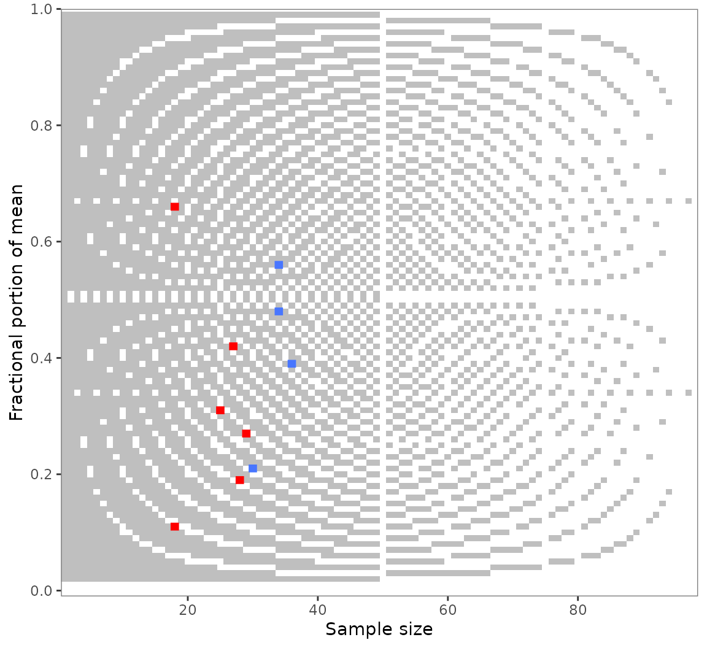
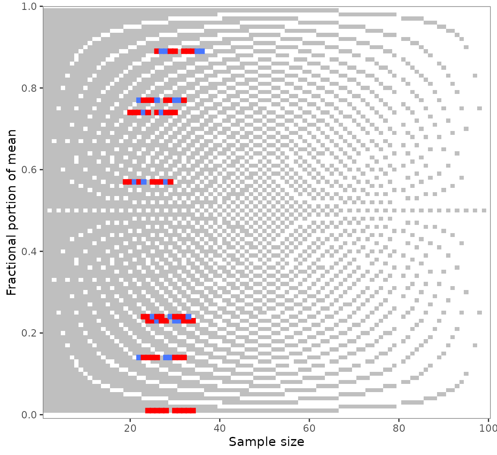

# GRIM

``` r
library(scrutiny)
```

Granularity-related inconsistency of means, or GRIM, is a test for the
mathematical consistency of reported means or proportions with the
corresponding sample size (Brown and Heathers 2017). It can be applied
to summary statistics of discrete numerical distributions. GRIM answers
a simple question: Is it possible that a granular distribution has both
the reported mean or percentage and the reported sample size?

This vignette covers scrutiny’s implementation of the GRIM test. It has
the following sections — to get started, though, you only need the first
one:

1.  The basic
    [`grim()`](https://lhdjung.github.io/scrutiny/reference/grim.md)
    function and a specialized mapping function,
    [`grim_map()`](https://lhdjung.github.io/scrutiny/reference/grim_map.md).

2.  Testing sequences of means or proportions.

3.  The
    [`audit()`](https://lhdjung.github.io/scrutiny/reference/audit.md)
    method for summarizing
    [`grim_map()`](https://lhdjung.github.io/scrutiny/reference/grim_map.md)’s
    results.

4.  The visualization function
    [`grim_plot()`](https://lhdjung.github.io/scrutiny/reference/grim_plot.md).

5.  Statistical benchmarks, such as granularity and the probability of
    GRIM inconsistency.

### Basic GRIM testing

#### Few cases: `grim()`

To test if a reported mean of 5.27 on a granular scale is
GRIM-consistent with a sample size of 43, run this:

``` r
grim(x = "5.27", n = 43)
#>  5.27 
#> FALSE
```

Note that `x`, the reported mean, needs to be a string. The reason is
that strings preserve trailing zeros, which can be crucial for
GRIM-testing. Numeric values don’t, and even converting them to strings
won’t help. A workaround for larger numbers of such values,
[`restore_zeros()`](https://lhdjung.github.io/scrutiny/reference/restore_zeros.md),
is discussed in
[`vignette("wrangling")`](https://lhdjung.github.io/scrutiny/articles/wrangling.md).

[`grim()`](https://lhdjung.github.io/scrutiny/reference/grim.md) has
some further parameters, but all of them can be used from within
[`grim_map()`](https://lhdjung.github.io/scrutiny/reference/grim_map.md).
The other parameters will be discussed in that context because
[`grim_map()`](https://lhdjung.github.io/scrutiny/reference/grim_map.md)
is often the more useful function in practice. Furthermore, although
[`grim()`](https://lhdjung.github.io/scrutiny/reference/grim.md) is
vectorized,
[`grim_map()`](https://lhdjung.github.io/scrutiny/reference/grim_map.md)
is more safe and convenient for testing multiple combinations of
means/proportions and sample sizes.

#### Many cases: `grim_map()`

If you want to GRIM-test more than a handful of cases, the recommended
way is to enter them into a data frame and to run
[`grim_map()`](https://lhdjung.github.io/scrutiny/reference/grim_map.md)
on the data frame. Two different ways to do that are discussed in
[`vignette("wrangling")`](https://lhdjung.github.io/scrutiny/articles/wrangling.md),
but here, I will only describe an easily accessible solution for a
single table.

Copy summary data from a PDF file and paste them into
[`tibble::tribble()`](https://tibble.tidyverse.org/reference/tribble.html),
which is available via scrutiny:

``` r
flying_pigs1 <- tibble::tribble(
  ~x,
"8.97",
"2.61",
"7.26",
"3.64",
"9.26",
"10.46",
"7.39"
) %>% 
  dplyr::mutate(n = 28)
```

Use RStudio’s multiple cursors to draw quotation marks around all the
`x` values, and to set commas at the end. See
[`vignette("wrangling")`](https://lhdjung.github.io/scrutiny/articles/wrangling.md),
section *With copy and paste*, if you are not sure how to do that.

Now, simply run
[`grim_map()`](https://lhdjung.github.io/scrutiny/reference/grim_map.md)
on that data frame:

``` r
grim_map(flying_pigs1)
#> # A tibble: 7 × 4
#>   x         n consistency probability
#>   <chr> <dbl> <lgl>             <dbl>
#> 1 8.97     28 FALSE              0.72
#> 2 2.61     28 TRUE               0.72
#> 3 7.26     28 FALSE              0.72
#> 4 3.64     28 TRUE               0.72
#> 5 9.26     28 FALSE              0.72
#> 6 10.46    28 TRUE               0.72
#> 7 7.39     28 TRUE               0.72
```

The `x` and `n` columns are the same as in the input. By default, the
number of `items` composing the mean is assumed to be 1. The main
result, `consistency`, is the GRIM consistency of the former three
columns. On the `probability` column, see section *The probability of
GRIM inconsistency*.

#### Scale items

If a mean is composed of multiple items, set the `items` parameter to
that number. Below are hypothetical means of a three-items scale. With
the single-item default, half of these are wrongly flagged as
inconsistent:

``` r
jpap_1 <- tibble::tribble(
   ~x,
  "5.90",
  "5.71",
  "3.50",
  "3.82",
  "4.61",
  "5.24",
) %>% 
  dplyr::mutate(n = 40)

jpap_1 %>% 
  grim_map()  # default is wrong here!
#> # A tibble: 6 × 4
#>   x         n consistency probability
#>   <chr> <dbl> <lgl>             <dbl>
#> 1 5.90     40 TRUE                0.6
#> 2 5.71     40 FALSE               0.6
#> 3 3.50     40 TRUE                0.6
#> 4 3.82     40 TRUE                0.6
#> 5 4.61     40 FALSE               0.6
#> 6 5.24     40 FALSE               0.6
```

Yet, all of them are consistent if the correct number of items is
stated:

``` r
jpap_1 %>% 
  grim_map(items = 3)
#> # A tibble: 6 × 4
#>   x         n consistency probability
#>   <chr> <dbl> <lgl>             <dbl>
#> 1 5.90    120 TRUE                  0
#> 2 5.71    120 TRUE                  0
#> 3 3.50    120 TRUE                  0
#> 4 3.82    120 TRUE                  0
#> 5 4.61    120 TRUE                  0
#> 6 5.24    120 TRUE                  0
```

It is also possible to include an `items` column in the data frame
instead:

``` r
jpap_2 <- tibble::tribble(
   ~x,    ~items,
  "6.92",  1,
  "3.48",  1,
  "1.59",  2,
  "2.61",  2,
  "4.04",  3,
  "4.50",  3,
) %>% 
  mutate(n = 30)

jpap_2 %>% 
  grim_map()
#> # A tibble: 6 × 4
#>   x         n consistency probability
#>   <chr> <dbl> <lgl>             <dbl>
#> 1 6.92     30 FALSE               0.7
#> 2 3.48     30 FALSE               0.7
#> 3 1.59     60 FALSE               0.4
#> 4 2.61     60 FALSE               0.4
#> 5 4.04     90 TRUE                0.1
#> 6 4.50     90 TRUE                0.1
```

#### Percentage conversion

An underappreciated strength of GRIM is testing percentages. Since these
are actually decimal numbers inflated by a factor of 100, percentages
come with two “free” decimal places. However, percentages are often
reported with decimal places beyond those two, which increases the
probability of GRIM-inconsistencies unless true values were correctly
reported.

Both [`grim()`](https://lhdjung.github.io/scrutiny/reference/grim.md)
and
[`grim_map()`](https://lhdjung.github.io/scrutiny/reference/grim_map.md)
have a `percent` parameter which, if set to `TRUE`, divides the `x`
values by 100 and increases the decimal count by two, so that
percentages can be tested just like means:

``` r
jpap_3 <- tibble::tribble(
  ~x,     ~n,
  "32.5",  438,
  "35.6",  455,
  "21.7",  501,
  "39.3",  516,
)

jpap_3 %>% 
  grim_map(percent = TRUE)
#> ℹ `x` converted from percentage
#> # A tibble: 4 × 4
#>   x         n consistency probability
#>   <chr> <dbl> <lgl>             <dbl>
#> 1 0.325   438 FALSE             0.562
#> 2 0.356   455 TRUE              0.545
#> 3 0.217   501 FALSE             0.499
#> 4 0.393   516 TRUE              0.484
```

#### Reconstructed values

Set `show_rec` to `TRUE` if you want the values that were reconstructed
during GRIM-testing to be displayed in the output. They will be columns
prefixed with `rec_`:

``` r
pigs1 %>% 
  grim_map(show_rec = TRUE) %>% 
  dplyr::select(4:8)   # output cut down for printing
#> # A tibble: 12 × 5
#>    probability rec_sum rec_x_upper rec_x_lower rec_x_upper_rounded_up
#>          <dbl>   <dbl>       <dbl>       <dbl>                  <dbl>
#>  1        0.68  231.         7.25        7.22                    7.25
#>  2        0.75  118.         4.76        4.72                    4.76
#>  3        0.71  152.         5.24        5.21                    5.24
#>  4        0.76   61.7        2.58        2.54                    2.58
#>  5        0.73  183.         6.78        6.74                    6.78
#>  6        0.72   75.0        2.71        2.68                    2.71
#>  7        0.71  203.         7.03        7.00                    7.03
#>  8        0.74  192.         7.38        7.35                    7.38
#>  9        0.73   84.8        3.15        3.11                    3.15
#> 10        0.69  214.         6.90        6.87                    6.9 
#> 11        0.75  125          5.00        5.00                    5   
#> 12        0.72    6.72       0.250       0.214                   0.25
```

The additional columns are —

- `rec_sum`: the sum total from which the mean or proportion was
  ostensibly derived.

- `rec_x_upper`: the upper reconstructed `x` value.

- `rec_x_lower`: the lower reconstructed `x` value.

- `rec_x_upper_rounded_up`: the `rec_x_upper` value rounded up.

- `rec_x_upper_rounded_down`: the `rec_x_upper` value rounded down.

- `rec_x_lower_rounded_up`: the `rec_x_lower` value rounded up.

- `rec_x_lower_rounded_down`: the `rec_x_lower` value rounded down.

The last four columns depend on `rounding`. Here, they follow the
default `"up_or_down"`, leading to two columns for each of `rec_x_upper`
and `rec_x_lower`. With a singular `rounding` procedure, such as `"up"`,
there would only be one column each, and thus, two in total. The
difference between these numbers is not greatly important, however,
because rounding up and down mostly delivers the same results.

Internally, GRIM-consistency is determined by whether or not a stated
`x` value is near-identical to either `rec_x_upper_rounded` or
`rec_x_lower_rounded`. This algorithm follows the charitable and
conservative protocol outlined by Brown and Heathers (2017). The `rec_*`
columns were inspired by Bauer and Francis (2021)’s Table 1 but present
values in slightly different ways.

### Summarizing results with `audit()`

Following up on a call to
[`grim_map()`](https://lhdjung.github.io/scrutiny/reference/grim_map.md),
the generic function
[`audit()`](https://lhdjung.github.io/scrutiny/reference/audit.md)
summarizes GRIM test results:

``` r
flying_pigs1 %>% 
  grim_map() %>% 
  audit() %>% 
  dplyr::select(1:5)   # output cut down for printing
#> # A tibble: 1 × 5
#>   incons_cases all_cases incons_rate mean_grim_prob incons_to_prob
#>          <int>     <int>       <dbl>          <dbl>          <dbl>
#> 1            3         7       0.429           0.72          0.595
```

These columns are —

1.  `incons_cases`: number of GRIM-inconsistent value sets.

2.  `all_cases`: total number of value sets.

3.  `incons_rate`: proportion of GRIM-inconsistent value sets.

4.  `mean_grim_prob`: average probability of GRIM inconsistency.

5.  `incons_to_prob`: ratio of `incons_rate` to `mean_grim_prob`.

6.  `testable_cases`: number of GRIM-testable value sets (i.e., those
    with a positive probability).

7.  `testable_rate`: proportion of GRIM-testable value sets.

### Visualizing results with `grim_plot()`

There is a specialized visualization function for GRIM test results,
[`grim_plot()`](https://lhdjung.github.io/scrutiny/reference/grim_plot.md):

``` r
jpap_5 <- tibble::tribble(
  ~x,        ~n,
  "7.19",    28,
  "4.56",    34,
  "0.42",    27,
  "1.31",    25,
  "3.48",    34,
  "4.27",    29,
  "6.21",    30,
  "3.11",    18,
  "5.39",    36,
  "5.66",    18,
)


jpap_5 %>% 
  grim_map() %>% 
  grim_plot()
```


[`grim_plot()`](https://lhdjung.github.io/scrutiny/reference/grim_plot.md)
can only be called on
[`grim_map()`](https://lhdjung.github.io/scrutiny/reference/grim_map.md)’s
output. It will fail otherwise:

``` r
grim_plot(mtcars)
#> Error in `grim_plot()`:
#> ! `grim_plot()` needs GRIM or GRIMMER test results.
#> ✖ `data` is not the output of `grim_map()`, `grim_map_seq()`, or
#>   `grim_map_total_n()`; or of the respective `grimmer_*()` functions.
#> ℹ The only exception is an "empty" plot that shows the background raster but no
#>   empirical test results. Create such a plot with `show_data = FALSE`.
```

With its unusual optics, this plot will probably not fit everyone’s
taste. The results of
[`grim_plot()`](https://lhdjung.github.io/scrutiny/reference/grim_plot.md)
are like those of error detection in general: They are not pretty, but
they put the unvarnished truth on display.

The plot is strictly based on the laws governing GRIM. Its background
raster shows all consistent (light) and inconsistent (dark) value pairs
for two decimal places. Empirical values are shown in blue if consistent
and red if inconsistent. Color settings and other ggplot2-typical
options are available via arguments. Read about them at
[`grim_plot()`](https://lhdjung.github.io/scrutiny/reference/grim_plot.md)’s
documentation.

You might notice the light vertical lines at $n = 40$ and $n = 80$: Few
values are flagged as inconsistent here. This reflects
[`grim_map()`](https://lhdjung.github.io/scrutiny/reference/grim_map.md)’s
charitable default of accepting values rounded either up *or* down from
5. If a different `rounding` specification is chosen in the
[`grim_map()`](https://lhdjung.github.io/scrutiny/reference/grim_map.md)
call, the plot raster will adjust automatically (although it will often
be the same as before):

``` r
jpap_5 %>% 
  grim_map(rounding = "ceiling") %>% 
  grim_plot()
```



All `rounding` values other than `up_from`, `down_from`, and
`up_from_or_down_from` are supported.

Speed is not much of a concern here because all the rasters are based on
data already stored within the package (in
[R/sysdata.rda](https://github.com/lhdjung/scrutiny/blob/main/R/sysdata.rda)),
so they don’t need to be generated on the spot every time the function
is called. See R/data-gen.R for the way they were generated.

### Testing numeric sequences with `grim_map_seq()`

GRIM analysts might be interested in a mean or percentage value’s
numeric neighborhood. Suppose you found multiple GRIM inconsistencies as
in our example `pigs1` data. You might wonder whether they are due to
small reporting or computing errors.

Use
[`grim_map_seq()`](https://lhdjung.github.io/scrutiny/reference/grim_map_seq.md)
to GRIM-test the values surrounding the reported means and sample sizes:

``` r
out_seq1 <- grim_map_seq(pigs1)
out_seq1
#> # A tibble: 160 × 7
#>    x         n consistency probability diff_var  case var  
#>    <chr> <int> <lgl>             <dbl>    <int> <int> <chr>
#>  1 4.69     25 FALSE              0.75       -5     1 x    
#>  2 4.70     25 FALSE              0.75       -4     1 x    
#>  3 4.71     25 FALSE              0.75       -3     1 x    
#>  4 4.72     25 TRUE               0.75       -2     1 x    
#>  5 4.73     25 FALSE              0.75       -1     1 x    
#>  6 4.75     25 FALSE              0.75        1     1 x    
#>  7 4.76     25 TRUE               0.75        2     1 x    
#>  8 4.77     25 FALSE              0.75        3     1 x    
#>  9 4.78     25 FALSE              0.75        4     1 x    
#> 10 4.79     25 FALSE              0.75        5     1 x    
#> # ℹ 150 more rows
```

#### Summaries with `audit_seq()`

As this output is a little unwieldy, run
[`audit_seq()`](https://lhdjung.github.io/scrutiny/reference/audit-special.md)
on the results:

``` r
audit_seq(out_seq1)
#> # A tibble: 8 × 12
#>   x         n consistency hits_total hits_x hits_n diff_x diff_x_up diff_x_down
#>   <chr> <int> <lgl>            <int>  <int>  <int>  <int>     <int>       <int>
#> 1 4.74     25 FALSE                4      2      2      2         2          -2
#> 2 5.23     29 FALSE                6      3      3      1         1          -2
#> 3 2.57     24 FALSE                6      3      3      1         1          -3
#> 4 6.77     27 FALSE                7      3      4      1         1          -3
#> 5 7.01     29 FALSE                3      3      0      1         2          -1
#> 6 3.14     27 FALSE                6      3      3      1         1          -3
#> 7 6.89     31 FALSE                8      4      4      1         1          -2
#> 8 0.24     28 FALSE                6      3      3      1         1          -3
#> # ℹ 3 more variables: diff_n <int>, diff_n_up <int>, diff_n_down <int>
```

Here is what the output columns mean:

- `x` and `n` are the original inputs, reconstructed and tested for
  `consistency` here.

- `hits` is the number of GRIM-consistent value combinations found
  within the specified `dispersion` range.

- `diff_x` reports the absolute difference between `x` and the next
  consistent dispersed value (in dispersion steps, not the actual
  numeric difference). `diff_x_up` and `diff_x_down` report the
  difference to the next higher or lower consistent value, respectively.

- `diff_n`, `diff_n_up`, and `diff_n_down` do the same for `n`.

The default for `dispersion` is `1:5`, for five steps up and down. When
the `dispersion` sequence gets longer, the number of hits tends to
increase:

``` r
out_seq2 <- grim_map_seq(pigs1, dispersion = 1:10)
audit_seq(out_seq2)
#> # A tibble: 8 × 12
#>   x         n consistency hits_total hits_x hits_n diff_x diff_x_up diff_x_down
#>   <chr> <int> <lgl>            <int>  <int>  <int>  <int>     <int>       <int>
#> 1 4.74     25 FALSE               12      6      6      2         2          -2
#> 2 5.23     29 FALSE               12      6      6      1         1          -2
#> 3 2.57     24 FALSE               11      6      5      1         1          -3
#> 4 6.77     27 FALSE               11      6      5      1         1          -3
#> 5 7.01     29 FALSE                6      6      0      1         2          -1
#> 6 3.14     27 FALSE               13      6      7      1         1          -3
#> 7 6.89     31 FALSE               12      6      6      1         1          -2
#> 8 0.24     28 FALSE               13      6      7      1         1          -3
#> # ℹ 3 more variables: diff_n <int>, diff_n_up <int>, diff_n_down <int>
```

#### Visualizing GRIM-tested sequences

It’s curious what happens when we plot the output of
[`grim_map_seq()`](https://lhdjung.github.io/scrutiny/reference/grim_map_seq.md).
Like regular GRIM plots, however, it does give us a sense of how many
tested values are consistent:

``` r
grim_plot(out_seq1)
```


The crosses appear because
[`grim_map_seq()`](https://lhdjung.github.io/scrutiny/reference/grim_map_seq.md)
creates sequences around both `x` and `n`. Restrict this process to any
one of these with the `var` argument:

``` r
out_seq1_only_x <- grim_map_seq(pigs1, var = "x")
out_seq1_only_n <- grim_map_seq(pigs1, var = "n")

grim_plot(out_seq1_only_x)
```


``` r
grim_plot(out_seq1_only_n)
```



### Handling unknown group sizes with `grim_map_total_n()`

#### Problems from underreporting

Unfortunately, some studies that report group averages don’t report the
corresponding group sizes — only a total sample size. This makes any
direct GRIM-testing impossible because only `x` values are known, not
`n` values. All that is feasible here in terms of GRIM is to take a
number around half the total sample size, go up and down from it, and
check which *hypothetical* group sizes are consistent with the reported
group means.
[`grim_map_total_n()`](https://lhdjung.github.io/scrutiny/reference/grim_map_total_n.md)
semi-automates this process, motivated by a recent GRIM analysis (Bauer
and Francis 2021).

The study examined by Bauer and Francis (2021) reported means of 5.3 and
4.71 for a total sample size of 40. With equal group sizes (i.e., 20 in
each group), only 5.3 is GRIM-consistent, not 4.71. However, Bauer and
Francis looked for a plausible scenario in which both means were
consistent. They checked if those scenarios came about if the 40
participants were distributed across the two groups in slightly
different ways.

More precisely, they went from a 20/20 group split to a 19/21 split,
then to an 18/22 split, and finally to a 17/23 split. In the latter
scenario, both means are consistent if 17 is paired with 4.71 and 23
with 5.3.

#### Semi-automated solution

Instead of going about this manually, call
[`grim_map_total_n()`](https://lhdjung.github.io/scrutiny/reference/grim_map_total_n.md),
followed by
[`audit_total_n()`](https://lhdjung.github.io/scrutiny/reference/audit-special.md)
for summarizing the results. It will find two further plausible
scenarios in which both means are consistent; more on that below.

``` r
df <- tibble::tibble(x1 = "4.71", x2 = "5.3", n = 40)

# Detailed results:
df_tested <- grim_map_total_n(df)
df_tested
#> # A tibble: 24 × 8
#>    x         n n_change consistency both_consistent probability  case dir  
#>    <chr> <int>    <int> <lgl>       <lgl>                 <dbl> <int> <fct>
#>  1 4.71     20        0 FALSE       FALSE                  0.8      1 forth
#>  2 5.3      20        0 TRUE        FALSE                  0        1 forth
#>  3 4.71     19       -1 FALSE       FALSE                  0.81     1 forth
#>  4 5.3      21        1 TRUE        FALSE                  0        1 forth
#>  5 4.71     18       -2 FALSE       FALSE                  0.82     1 forth
#>  6 5.3      22        2 TRUE        FALSE                  0        1 forth
#>  7 4.71     17       -3 TRUE        TRUE                   0.83     1 forth
#>  8 5.3      23        3 TRUE        TRUE                   0        1 forth
#>  9 4.71     16       -4 FALSE       FALSE                  0.84     1 forth
#> 10 5.3      24        4 TRUE        FALSE                  0        1 forth
#> # ℹ 14 more rows

# Summary:
audit_total_n(df_tested)
#> # A tibble: 1 × 8
#>   x1    x2        n hits_total hits_forth hits_back scenarios_total hit_rate
#>   <chr> <chr> <int>      <int>      <int>     <int>           <int>    <dbl>
#> 1 4.71  5.3      40          3          1         2              12     0.25
```

Each “hit” is a scenario in which both `x1` and `x2` are GRIM-consistent
with one of the two hypothetical group sizes. By default
(`dispersion = 0:5`), the function goes five steps up and down from `n`.

#### Testing both ways

Bauer and Francis (2021) only took those scenarios into account in which
4.71 was combined with the respective smaller group and 5.3 with the
larger one, so 17/23 is the only “hit” they found (my term). However,
the converse way of assigning hypothetical group sizes to the reported
means would be equally justified.
[`grim_map_total_n()`](https://lhdjung.github.io/scrutiny/reference/grim_map_total_n.md),
therefore, conducts two sets of GRIM tests: one for each way of pairing
means and group sizes.

It thus finds the group sizes 19/21 and 16/24 to be GRIM-consistent if
5.3 is combined with the smaller group and 4.71 with the larger one
(i.e., with pairing reversed from Bauer and Francis’ analysis). In the
[`audit_total_n()`](https://lhdjung.github.io/scrutiny/reference/audit-special.md)
summary of the function’s output, results from original pairing are
named `hits_forth`, those from reversed pairing are named `hits_back`,
and their sum is named `hits_total`.

This example only features one case — the `df` tibble has just a single
row. It could have any number of rows, though; and
[`grim_map_total_n()`](https://lhdjung.github.io/scrutiny/reference/grim_map_total_n.md)
would determine and count the “hits” for each of them. See the
*Examples* section of
[`grim_map_total_n()`](https://lhdjung.github.io/scrutiny/reference/grim_map_total_n.md)’s
documentation.

### GRIM statistics

#### The probability of GRIM inconsistency

##### General description

The `probability` column in a tibble returned by
[`grim_map()`](https://lhdjung.github.io/scrutiny/reference/grim_map.md)
is the probability of GRIM inconsistency, i.e.:

$$P = max\left( 0,\frac{10^{D} - NL}{10^{D}} \right)$$

where $D$ is the number of decimal places in $X$ (the mean or
proportion), $N$ is the sample size, and $L$ is the number of scale
items. The fraction will never be greater than 1, and the $max{()}$
function limits it at 0.

Consider a mean $X$ that was ostensibly derived from integer data. It
has $D$ decimal places, but is otherwise random: the integer part is
irrelevant in any case, and the exact digits that occupy the $D$ decimal
places are ignored. $P$, then, is the probability that $X$ is
GRIM-inconsistent. Naturally, $P$ is also the proportion of inconsistent
value sets with $D$ decimal places, a sample size of $N$, and $L$ scale
items.

In real-world scenarios, one would not usually assume $X$ to be random
at the outset of an investigation, but this can be interesting as a
contrasting assumption. If a study has many GRIM-inconsistent value sets
with very high probabilities of inconsistency, it may suggest that the
anomalies are not explained by small deviations from true values
(although
[`grim_map_seq()`](https://lhdjung.github.io/scrutiny/reference/grim_map_seq.md)
is more informative on this point). Rather, such a finding could raise
concerns that these statistics did not come about as part of a regular
research process.

##### Functions

[`grim_probability()`](https://lhdjung.github.io/scrutiny/reference/grim-stats.md)
takes the arguments `x`, `n`, `items`, and `percent` as in
[`grim()`](https://lhdjung.github.io/scrutiny/reference/grim.md) and
[`grim_map()`](https://lhdjung.github.io/scrutiny/reference/grim_map.md).
As before, `x` must be a string to capture any trailing zeros:

``` r
grim_probability(x = "1.40", n = 72)
#> [1] 0.28

grim_probability(x = "5.93", n = 80, items = 3)
#> [1] 0

# Enter `x` as a string to preserve trailing zeros:
grim_probability(x = "84.27", n = 40, percent = TRUE)
#> [1] 0.996
```

[`grim_map()`](https://lhdjung.github.io/scrutiny/reference/grim_map.md)
displays a `probability` column that shows the probability of GRIM
inconsistency. It is derived using
[`grim_probability()`](https://lhdjung.github.io/scrutiny/reference/grim-stats.md).

In addition,
[`grim_total()`](https://lhdjung.github.io/scrutiny/reference/grim-stats.md)
takes the same arguments but returns only the numerator of the fraction
in the above formula:

``` r
grim_total(x = "1.40", n = 72)
#> [1] 28

grim_total(x = "5.93", n = 80, items = 3)
#> [1] -140

grim_total(x = "84.27", n = 40, percent = TRUE)  # Enter `x` as string to preserve trailing zero
#> [1] 9960
```

The result is the total number of GRIM-inconsistent value sets with the
given parameters. However, this is generally less useful than
[`grim_probability()`](https://lhdjung.github.io/scrutiny/reference/grim-stats.md):
the result is only comparable across different numbers of decimal places
when normalized by $10^{D}$.

##### Origins

The formula for the probability of GRIM inconsistency is arguably
implicit in Brown and Heathers’ (2017) paper on GRIM. The numerator is a
transformation of the formula presented on p. 364, and the authors
discuss a common special case of the probability (interpreted as a
proportion) on p. 367:

> With reporting to two decimal places, for a sample size $N < 100$
> \[and a single item\], a random mean value will be consistent in
> approximately $N$% of cases.

Assuming $N = 70$ and inserting all of these values into the above
formula returns

$$max\left( 0,\frac{10^{2} - 70 \times 1}{10^{2}} \right) = 0.3$$

so that a random mean will be inconsistent in about 30% of cases and,
conversely, consistent in about 70%.

Here is the same in code (assuming an arbitrary mean with two decimal
places):

``` r
grim_probability(x = "0.99", n = 70)
#> [1] 0.3
```

#### Granularity and scale items

The granularity of a non-continuous distribution is the minimal amount
by which two means or proportions of the distribution can differ. It is
derived from the sample size and the number of scale items. The number
of items, in turn, naturally follows from the distribution’s sample size
and granularity.

##### Formulas

The granularity ($G$) formula is

$$G = \frac{1}{NL}$$

where $N$ is the sample size and $L$ is the number of items.

The scale items formula is the converse:

$$L = \frac{1}{NG}$$

##### Functions

Consider an ordinal distribution with 80 observations and five items. To
get its granularity, run this:

``` r
grim_granularity(n = 80, items = 5)
#> [1] 0.0025
```

Now, imagine a distribution with 50 observations and a granularity of
0.01. To get the number of its items (actual or effective), use this
code:

``` r
grim_items(n = 50, gran = 0.01)
#> [1] 2
```

As the number of items itself has a granularity of 1, a call to
[`grim_items()`](https://lhdjung.github.io/scrutiny/reference/grim_granularity.md)
that doesn’t return whole numbers indicates a problem in earlier
computations. A warning to that effect will be displayed:

``` r
grim_items(n = c(50, 65, 93), gran = 0.02)
#> Warning: 2 out of 3 item counts aren't whole numbers.
#> → This concerns `0.769` and `0.538`.
#> ! Item counts have a granularity of 1, so they should be whole numbers. Are you
#>   sure about the `n` and `gran` values?
#> [1] 1.0000000 0.7692308 0.5376344
```

## References

Bauer, Patricia J., and Gregory Francis. 2021. “Expression of Concern:
Is It Light or Dark? Recalling Moral Behavior Changes Perception of
Brightness.” *Psychological Science* 32 (12): 2042–43.

Brown, Nicholas J. L., and James A. J. Heathers. 2017. “The GRIM Test: A
Simple Technique Detects Numerous Anomalies in the Reporting of Results
in Psychology.” *Social Psychological and Personality Science* 8 (4):
363–69.
