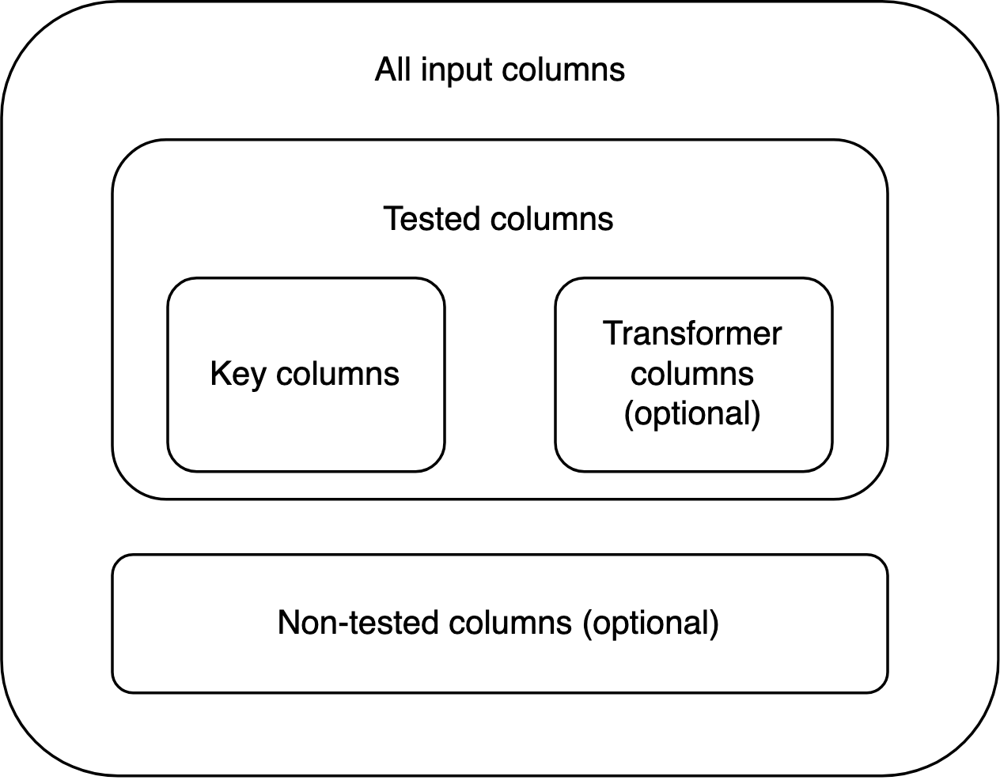

```{r, include = FALSE}
knitr::opts_chunk$set(
  collapse = TRUE,
  comment = "#>"
)
```

```{r include=FALSE}
# Dev only: load scrutiny from within scrutiny
devtools::load_all(".")
```

```{r setup}
library(scrutiny)
```

# Introduction

When implementing consistency tests in R, you shouldn't have to start from zero. This vignette introduces scrutiny's support system for writing new consistency testing functions.

Following the vignette will dramatically simplify the implementation of basic and advanced testing routines via function factories. It will enable you to write entire families of functions in a streamlined way: If you are familiar with any one scrutiny-style consistency test, you will immediately be able to make some sense of the other ones. This is true across all levels of consistency testing.

Below is an outline of these levels, and of the present vignette, with GRIM as a paradigmatic example. If a valid consistency test is newly implemented with at least the first step, I'll be happy to accept a pull request to scrutiny. This means you'll only have to implement the core test itself, without even reading the vignette any further.

1.  A bare-bones, non-exported (!) function for testing a single set of cases, such as `grim_scalar()`.

2.  A vectorized version of the single-case function, such as `grim()`.

3.  A specialized mapping function that applies the single-case function to a data frame, such as `grim_map()`.

4.  A method for the `audit()` generic that summarizes the results of number 3.

5.  A visualization function that plots the results of number 3, such as `grim_plot()`.

6.  A mapping function that checks if slightly varied input values are consistent with the respective other reported values, such as `grim_map_seq()`.

7.  A mapping function to be used if only the total sample size was reported (in a study with two groups), not the individual group sizes, such as `grim_map_total_n()`.

8.  `audit_seq()` and `audit_total_n()` already work with the output of numbers 6 and 7, respectively. They still have to be specifically documented.

I will use a toy test called SCHLIM as a model to demonstrate the minimal steps needed to implement consistency tests, scrutiny-style. Note that SCHLIM doesn't have any significance beyond standing in for serious consistency tests. Any real implementation might well be more complex than the brief code snippets below. I will also recur to existing functions that implement actual tests, and that the reader may be familiar with.

Most functions discussed here deal with data frames. I always use [tibbles](https://r4ds.had.co.nz/tibbles.html), and I strongly recommend the same to you. There's no guarantee that each of those functions works with non-tibble data frames as it does with tibbles. Please make sure to follow the [tidyverse style guide](https://style.tidyverse.org/) as well as the scrutiny-specific conventions laid out below, wherever applicable.

If you'd like to write a new package, work with Hadley Wickham's book *R Packages* [@wickham2015] in its most recent version, which is [free online](https://r-pkgs.org/).

# 1. Single-case

The first function is the most important one. It contains the core implementation of the test. Although it is not exported itself, all other steps build up on it, and all of them are exported.

This function takes two or more arguments of length 1 that are coercible to numeric. This means they either are numeric themselves or they are strings that can be converted to numbers. The function tests them for consistency and returns a single Boolean value: It's `TRUE` if the inputs are mutually consistent, and `FALSE` if they aren't.

Other arguments might still be necessary, especially if your function reconstructs rounded numbers. An argument that determines how the function rounds should be called `rounding`. The function should internally call `reround()`. The same goes for "unrounding" (i.e., reconstructing rounding bounds) and `unround()`. See also `vignette("rounding")`. A single-case function that performs rounding will also need a helper to count decimal places, which should be `decimal_places_scalar()`.

The function's name is that of the test, followed by `_scalar` which refers to the one-case limit. If your function happens to be applicable to multiple value sets already due to R's natural vectorization, leave out `_scalar` and skip the next section. (This will rarely be the case because every single argument will need to be vectorized.)

```{r}
 schlim_scalar <- function(y, n) {
   y <- as.numeric(y)
   n <- as.numeric(n)
   y / 3 > n
 }

schlim_scalar(y = 2, n = 7)
```

# 2. Vectorized

The easiest way to turn a scalar function into a vectorized (i.e., multiple-case) function is to run `Vectorize()` on it. The name of the resulting function should be the lower-case name of the test itself, which is also the name of the single-case function without `_scalar`:

```{r}
schlim <- Vectorize(schlim_scalar)

schlim(y = 10:15, n = 4)
```

Functions created this way can be useful for quick testing, but unlike mapping functions, they are not great to build upon. They should never be called within other functions. Therefore, `schlim()` is not used in the remaining part of the vignette.

# 3. Mapper

The most important practical use of a consistency test within scrutiny is to apply it to entire data frames, as `grim_map()` does. That's also the starting point for every other function below.

## Creating mappers with `function_map()`

The safest and easiest way to create a mapper is via the function factory `function_map()`. A function "manufactured" this way is also guaranteed to fulfill all of the requirements for mapper functions listed further below. That's a major benefit because the list of requirements is long, and all of the follow-up functions in the remaining vignette assume that the mapper fulfills them.

You will have no such troubles with `function_map()`:

```{r}
schlim_map <- function_map(
  .fun = schlim_scalar,
  .reported = c("y", "n"),
  .name_test = "SCHLIM"
)

# Example data:
df1 <- tibble::tibble(y = 16:25, n = 3:12)

schlim_map(df1)
```

-   `.fun` is the single-case function from section 1.

-   `.reported` is a string vector naming the reported statistics that `.fun` tests for consistency with each other.

-   `.name_test` simply names the consistency test.

As you can see, `function_map()` is not a helper used inside other functions when creating them with `function()` --- instead, it takes the place of `function()` itself. This makes it a so-called function factory, or more precisely, a function operator, a.k.a. decorator [@wickham2019, ch. 10-11].

To export a function manufactured this way from your own package, make sure to follow [this purrr FAQ](https://purrr.tidyverse.org/reference/faq-adverbs-export.html). (Incredible as it sounds, scrutiny will then take on the role of purrr.) Also, see the worked example for the `.onLoad` pattern in `function_map()`'s documentation.

## Writing mappers manually

If `function_map()` is so handy, why would you ever not use it? There are four reasons:

-   Manufactured functions don't have any tailor-made checks or error messages for any specific consistency test. (They do have some more general checks and errors.)

-   They don't support transformer columns (see *Terminology* below).

-   They are incapable of creating columns internally other than `"consistency"`.

-   Finally, when using a manufactured function, any test-specific arguments the user might specify won't trigger RStudio's autocomplete.

`grim_map()` and `debit_map()` were both "handwritten" rather than produced by `function_map()`. However, none of these issues affect the `"consistency"` results, and simply going with `function_map()` might often be the better option.

The remaining part of section 3 explains how to write mapper functions manually. It is quite detailed because it's important to get these things right: Every other function in the rest of the vignette builds up on it. Still, the practical steps are not that complicated, as you can see in the code examples.

### Terminology

It's important to distinguish between *key arguments or columns* and other arguments or columns. The key arguments in a scalar or vectorized consistency-testing function are the values that are tested for consistency with each other, such as `x` and `n` in `grim()`. By extension, key columns are those that contain such values. Every key column has the same name as the respective key argument.

A *transformer column* is a column that is not key itself, but transforms the values of one or more key columns. In this way, transformer columns indirectly factor into the consistency test. An example is the optional `items` column in `grim_map()`'s input data frame.

Key and transformer columns are *tested* columns because they factor into the test. Any other columns are *non-tested*.

### Requirements

A general system for implementing consistency tests needs some consistency itself. This is especially true for mapper functions, because all functions further down the line rely on the mapper's output having some very specific properties.

The level of detail in these requirements might seem pedantic. I still encourage you to follow every step when handwriting a new mapping function. It's easier than it looks at first, and many aspects are indispensable. That is because each function discussed below builds up on the mapper, and their interplay follows a carefully concerted system. If a mapper misses any one ingredient, those other functions may fail.

The (only) requirements for a mapping function are:

1.  Its name ends on `_map` instead of `_scalar` but is otherwise the same as the name of the respective `_scalar` function.

2.  Its first argument, `data`, is a data frame that contains the key columns of the respective consistency test. Other columns are permitted but don't factor into the test unless they are transformer columns. The mapper's user never needs to include transformer columns and can always replace them by specifying arguments by the same names as those columns. If the user specifies such an argument but the input data frame contains a column by the same name, the function throws an error. No column of the input data frame should be named `"consistency"`.

3.  Its return value is a tibble data frame that contains all of the key input columns. The types of these columns are the same as in the input data frame. They are the first (i.e., leftmost) columns in the output, even if the input isn't ordered this way. If any of these columns are modified within the mapping function, the output should include the modified columns, not the original ones. Examples are the effects of transformer columns, but also the change displayed by the `"x"` column in the output of `grim_map(percent = TRUE)`. Transformer columns should not be included in the output.

4.  The output data frame also contains a Boolean column named `"consistency"`. It contains the results of the consistency test, as determined by the respective `_scalar` function. In each row, `"consistency"` is `TRUE` if the values to its left are mutually consistent, and `FALSE` if they aren't. This column is placed immediately to the right of the key columns.

5.  If the underlying single-case function performs rounding or unrounding, it should internally call `reround()` and/or `unround()`, respectively. The output data frame of the mapper function will then inherit an S3 class (see section *S3 classes* below) such as `"scr_rounding_up_or_down"`: It consists of `"scr_rounding_"` followed by the rounding specification, e.g., `"up_or_down"`. The latter should also be the default rounding and unrounding specification. This specification can be supplied by the user via an argument called `rounding`, which is then passed down to the single-case function. If `reround()` is called within the mapper, all of its arguments need to be passed down from the mapper, which itself has all of the same arguments, with the same defaults. The same applies to `unround()`.

6.  The output data frame inherits an S3 class that consists of `"scr_"` (short for scrutiny), followed by the name of the mapper function. For example, the output of `grim_map()` inherits the `"scr_grim_map"` class. The `"scr_"` prefix is necessary for some follow-up computations introduced below, so it should be used even within functions that are not part of scrutiny. Any other classes added to the output data frame should also start on `"scr_"`. None of them should end on `"_map"`.

### Implications

Some implications of these requirements, and of the fact that the design space for mapper functions is not restricted in any other ways:

Anything that factors into the consistency test other than tested columns needs to be conveyed to the mapper function via arguments. An example is the `rounding` argument in `grim_map()`. Mapper functions don't need to allow for transformer columns.

The input data frame is not necessarily a tibble, but the output data frame is. The input data frame never contains a column named `"consistency"`, but the output data frame always does.

Key columns may or may not be modified by transformer columns and/or arguments.

The output data frame may or may not contain non-tested columns from the input. It may or may not contain non-tested columns created within the mapper function itself. (This can be useful, as with `"ratio"` in `grim_map()`'s output.) Any such non-tested, non-`"consistency"` columns go to the right of `"consistency"`.

If the number of key columns is $k$, the index of `"consistency"` in the output is $k+1$.

Besides the `"scr_*_map"` class, the output data frame may inherit any number of other classes added within the mapper, so long as they start on `"scr_"` but don't end on `"_map"`. It can't inherit the `"grouped_df"` or `"rowwise_df"` classes added by `dplyr::group_by()` and `dplyr::rowwise()`, respectively. If either of these functions is called within the mapper, it needs to be followed by `dplyr::ungroup()` at some point.

The columns of the input data frame are organized like this:

{width="585"}

By contrast, the columns of the output data frame look like this:

{width="585"}

### Practical steps

```{r include=FALSE}
# Just internally, so that the function source code below works:
add_class <- scrutiny:::add_class
```

How to actually write mapper functions? Again, I recommend `function_map()`. The functions created below are conceptually very similar to it.

Apply the `_scalar` function to the input data frame using `purrr::pmap_lgl()`:

```{r}
schlim_map_alt1 <- function(data, ...) {
  consistency <- purrr::pmap_lgl(data, schlim_scalar, ...)
  out <- tibble::tibble(y = data$y, n = data$n, consistency)
  out <- dplyr::relocate(out, y, n, consistency)
  out <- add_class(out, "scr_schlim_map")  # See section "S3 classes" below
  out
}
```

Alternatively, call `dplyr::rowwise()` and directly mutate `"consistency"`:

```{r}
schlim_map_alt2 <- function(data, ...) {
  data %>% 
    dplyr::rowwise() %>% 
    dplyr::mutate(consistency = schlim_scalar(y, n, ...)) %>% 
    dplyr::ungroup() %>% 
    dplyr::relocate(y, n, consistency) %>% 
    add_class("scr_schlim_map")  # See section "S3 classes" below
}
```

Both approaches should lead to the same results:

```{r}
schlim_map_alt1(df1)

schlim_map_alt2(df1)
```

You should let `function_map()` produce an equivalent function to make sure that it returns the same output as your handwritten one. To compare the output data frames, don't just eyeball them. Use `waldo::compare()` or, if you already run tests with testthat, `expect_equal()`. Of course, if your handwritten function creates new columns beyond `"consistency"`, you'll have to remove them from the output first.

### S3 classes

If you don't know what S3 classes are, don't worry. Just copy and paste the function below, and call it at the end of your mapper function. `x` is the output data frame, and `new_class` is a string vector. `new_class` consists of one or more "classes" that will be added to the existing classes of `x`:

```{r, eval=FALSE}
add_class <- function(x, new_class) {
  class(x) <- c(new_class, class(x))
  x
}
```

### Internal helpers

Within scrutiny, many functions that are exported for users internally call helper functions that are not, such as `add_class()`. You might be writing your own function following the design of an exported scrutiny function, but suddenly you can't access an unknown function that you seem to need!

If you'd like to employ such an internal helper for yourself, specify its namespace with three colons, like `scrutiny:::add_class`. However, you should only use this trick to copy and paste the helper's source code into your own source code. (That's why I left out the parentheses --- return the function itself.) Never rely on calling a function with `:::`, because these internals are not actually meant for users. They can easily shift and vanish without notice.

When directly looking for internal helpers in scrutiny's source code, start at the [utils.R](https://github.com/lhdjung/scrutiny/blob/main/R/utils.R) file. Most helpers can be found there, and some of them feature rudimentary documentation.

# 4. `audit()` method

## Introduction

`audit()` is an S3 generic for summarizing scrutiny's test result data frames, especially those of mapper functions such as `grim_map()`. Every mapper function should have a corresponding `audit()` method.

This is an aspect of object-oriented programming (OOP), but scrutiny's use of OOP is simple even by the low standards of R. Your mapper function already returns a specific class, such as `"scr_grim_map"` or `"scr_debit_map"`. In `schlim_map()`, we added the `"scr_schlim_map"` class in addition to existing classes:

```{r}
df1_tested <- schlim_map(df1)
class(df1_tested)
```

Your `audit()` method is simply a function named `audit` plus a dot and your specific class:

```{r, error=TRUE}
audit.scr_schlim_map <- function(data) {
  "dummy output"
}

audit(df1_tested)

# This doesn't work because no method was defined:
audit(iris)
```

## Practical steps

Every `audit()` method for consistency test results should be the same insofar as all consistency tests are the same. It should have a single argument named `data`. Its return value should be a tibble with at least these columns:

1.  `incons_cases` counts the inconsistent cases, i.e., the number of rows in the mapper's output where `"consistency"` is `FALSE`.

2.  `all_cases` is the total number of rows in the mapper's output.

3.  `incons_rate` is the ratio of `incons_cases` to `all_cases`.

Apart from these, see for yourself which summary statistics your `audit()` method should compute. Means of variables in the `*_map()` function's output and their ratios to each other might be sensible choices.

All existing `audit()` methods for consistency tests return tibbles with a single row only. This makes sense because there is no obvious grouping variable for the input data frame, which would lead to multiple rows in `audit()`'s output. However, there might be good reasons for multiple rows when summarizing the results of other tests, so this is not a requirement.

## Documentation template

Each `audit()` method should be documented on the same page as its respective mapper function. It should have its own section. Create it with `write_doc_audit()`:

```{r}
audit_grim  <- audit(grim_map(pigs1))
audit_debit <- audit(debit_map(pigs3))

write_doc_audit(sample_output = audit_grim,  name_test = "GRIM")

write_doc_audit(sample_output = audit_debit, name_test = "DEBIT")
```

This function prepares a rogygen2 block section. It fills the three standard columns out for you, and it leaves space to describe any other columns. Also, the internal checks of `write_doc_audit()` make sure that you programmed a correct `audit()` method, as represented by the value of the `sample_output` argument.

Copy the output from the console and paste it into the rogygen2 block of your `_map` function. To preserve the numbered list structure when indenting rogygen2 comments with `Ctrl`+`Shift`+`/`, leave empty lines between the pasted output and the rest of the block.

# 5. Visualization function

## Introduction

It is hard to give general advice on how to implement visualization functions for the results of consistency tests. As with the `_scalar` function, the best way to plot such results greatly depends on the idiosyncratic nature of the consistency test itself. When comparing the looks of `grim_plot()` and `debit_plot()`, it becomes clear that two very different things are going on. (This is mainly because granularity is crucial for GRIM but not for DEBIT.)

## Requirements

Nevertheless, some general requirements do apply to scrutiny-style visualization functions. They are much more like arbitrary conventions than the requirements for mapper functions, which often meet very precise technical needs. Visualization functions are also dead ends for programming: No other computations build up on them, at least not within scrutiny.

As a result, the rules below are admittedly somewhat less important. If you violate them, nobody but me will be sad about it.

1.  All plots should be based on ggplot2. They don't need to implement any newly created layers, such as geoms or themes. Indeed, neither of the two existing visualization functions relies on any new layers.
2.  The visualization function's name should be that of the test itself (in lowercase), followed by `_plot`. Naturally, this doesn't apply to methods for generic functions like `plot()` or `ggplot2::autoplot()`.
3.  Its first argument, `data`, is a data frame that is the result of a call to the respective mapper function, such as `grim_map()` or `debit_map()`. The visualization function makes sure this is true by checking that `data` inherits the special class added within the mapper, such as `scr_grim_map` or `scr_debit_map`. If `data` fails this check, the function throws an error.
4.  The function should display consistent and inconsistent value sets. The color defaults should be `"royalblue1"` for consistent value sets and `"red"` for inconsistent ones. The user can override these defaults via two arguments named `color_cons` for consistent value sets and `color_incons` for inconsistent ones.
5.  If certain layers are optional rather than essential to the plot, their display can be controlled via Boolean arguments that start on `show_`. Examples are `show_data` in `grim_plot()` or `show_outer_boxes` in `debit_plot()`. Only arguments of this kind should start on `show_`. They should have defaults (which will usually be `TRUE`, but this is not a requirement).
6.  The most important aesthetics for the geoms are passed down to the latter via arguments. Namely, these are `alpha` (i.e. opacity), `color`, and `size`, in this order. If multiple geoms need `alpha`, `color`, and `size` arguments, the latter should start with an expression that stands for the geom, not with `alpha`, `color`, or `size`, respectively. Examples are `line_alpha`, `line_color`, and `line_size` in `debit_plot()`.
7.  Point 6 does not apply if the respective parameter is determined by the data, like the size of `geom_tile()` in `debit_plot()`. This includes cases where a parameter is specified as a constant. An example is the `geom_rect()` call for empirical data in `grim_plot()`, where `size` is constant at `1` but the effective size is determined by the granularity of the data. If the respective colors are covered by `color_cons` and `color_incons`, not further `color` argument is needed for them.
8.  Arguments passed on to aesthetics should have the same defaults as those aesthetics themselves have in ggplot2 unless there is a compelling reason for different defaults. Again, `line_alpha`, `line_color`, and `line_size` are examples for this.

See also the more general advice on [using ggplot2 in packages](https://ggplot2.tidyverse.org/articles/ggplot2-in-packages.html).

# 6. Sequence mapper

## Introduction

When reported values are inconsistent, it's never obvious why. Consistency tests provide mathematical certainty in their results, but there is a trade-off: They don't suggest any clear causal story about the summary statistics. (Contrast this with a reconstruction technique such as [SPRITE](https://lukaswallrich.github.io/rsprite2/index.html), which does not aim at mathematical proof but does point towards major issues with the origins of the data.)

One possible reason for inconsistencies lies in small mistakes in computing and/or reporting by the original researchers. Indeed, when @brown2017 reanalyzed some of the data sets behind GRIM inconsistencies, they often found "a straightforward explanation, such as a minor error in the reported sample sizes, or a failure to report the exclusion of a participant" (p. 368).

It may therefore be useful to test the numeric neighborhood of inconsistent reported values. Are there any nearby values that are consistent with the other statistics? If so, how many and where? The problem might then be due to a simple oversight. However, it would be very cumbersome to test each candidate value manually, or even to test sequences that were manually created with functions such as `seq_distance()`.

Fortunately, scrutiny automates this process. `grim_map_seq()` and `debit_map_seq()` provide an instant assessment of whether or not inconsistent reported values are close to consistent numbers. They also allow the user to specify how many steps away from the reported value are permitted when looking for consistent ones, as well as some other options.

## Practical steps

Although the code that underlies them is fairly complex, these functions themselves were written in a very simple way. Here are the ones for GRIM and DEBIT:

```{r, eval=FALSE}
grim_map_seq <- function_map_seq(
  .fun = grim_map,
  .reported = c("x", "n"),
  .name_test = "GRIM",
  .name_class = "scr_grim_map_seq"
)

debit_map_seq <- function_map_seq(
  .fun = debit_map,
  .reported = c("x", "sd", "n"),
  .name_test = "DEBIT",
  .name_class = "scr_debit_map_seq"
)
```

Any consistency test that is already implemented in a mapper function like `grim_map()` and `debit_map()` can receive its own `*_map_seq()` function just as easily using `function_map_seq()`. That is due to scrutiny's streamlined design conventions --- specifically, the requirements for mapper functions laid out in section 3.

Let's write a sequence mapper for SCHLIM:

```{r}
schlim_map_seq <- function_map_seq(
  .fun = schlim_map,
  .reported = c("y", "n"),
  .name_test = "SCHLIM",
  .name_class = "scr_schlim_map_seq"
)

# Test dispersed sequences:
out_seq <- schlim_map_seq(df1)
out_seq

# Summarize:
audit_seq(out_seq)
```

By default, a `*_map_seq()` function only creates sequences around inconsistent input values. That is because its primary purpose is to shed light on inconsistencies in reported statistics. Override the default with `include_consistent = TRUE`:

```{r}
df1 %>% 
  schlim_map_seq(include_consistent = TRUE) %>% 
  audit_seq()

# Compare with the original values:
df1
```

As with `function_map()`, if you want to export a function created with `function_map_seq()`, follow [this purrr FAQ](https://purrr.tidyverse.org/reference/faq-adverbs-export.html).

# 7. Total-n mapper

## Introduction

The reporting of summary statistics is often insufficient --- certainly from an error detection point of view. In particular, values such as means and standard deviations are not always accompanied by their respective group sizes, but only by a total sample size.

This presents a problem for consistency tests that rely on reported group sizes, such as GRIM. It requires splitting the reported total into groups and creating multiple plausible scenarios of group sizes that add up to the total. Although no definitive test results can be gained this way, it does help to see whether reported values are consistent with at least some of the plausible group sizes [@bauer_expression_2021].

## Practical steps

`function_map_total_n()` creates new functions which follow this very scheme by applying a given consistency test to multiple combinations of reported and hypothetical summary statistics. It is the powerhouse behind `grim_map_total_n()` and `debit_map_total_n()`, just as `function_map_seq()` is the powerhouse behind `grim_map_seq()` and `debit_map_seq()`. See the [case study in the GRIM vignette](https://lhdjung.github.io/scrutiny/articles/grim.html#handling-unknown-group-sizes-with-grim_map_total_n) for an example of how `grim_map_total_n()` works out in practice.

As with `function_map_seq()`, creating a manufactured `*_total_n()` function is very easy. Just let the function factory do the work for you:

```{r, eval=FALSE}
grim_map_total_n <- function_map_total_n(
  .fun = grim_map,
  .reported = "x",
  .name_test = "GRIM",
  .name_class = "scr_grim_map_total_n"
)

debit_map_total_n <- function_map_total_n(
  .fun = debit_map,
  .reported = c("x", "sd"),
  .name_test = "DEBIT",
  .name_class = "scr_debit_map_total_n"
)
```

To drive this point home, let's do the same with SCHLIM:

```{r}
schlim_map_total_n <- function_map_total_n(
  .fun = schlim_map,
  .reported = "y",
  .name_test = "SCHLIM",
  .name_class = "scr_schlim_map_total_n"
)

# Example data:
df_groups_schlim <- tibble::tribble(
  ~y1, ~y2, ~n,
   84,  37,  29,
   61,  55,  26
)

# Test dispersed sequences:
out_total_n <- schlim_map_total_n(df_groups_schlim)
out_total_n

# Summarize:
audit_total_n(out_total_n)
```

The same pattern can be applied to any other mapper function that fulfills the requirements from section 3. One of the columns, `n`, will have its values dispersed from half, internally using `disperse_total()`. See the advice on exporting manufactured functions at the end of section 6.

# 8. Documenting `audit_seq()` and `audit_total_n()`

## Introduction

The output of sequence mappers and total-n mappers is very comprehensive. This makes it somewhat unwieldy and creates a need for summaries. As a first step, the user can always call `audit()` on the tibbles returned by manufactured functions like `grim_map_seq()`. It will go by the `"*_map"` class added within the basic mapper function, such as `grim_map()`, and return the regular output of the respective `audit()` method.

However, scrutiny features two specialized functions for summarizing the results of manufactured `*_seq()` or `*_total_n()` functions: `audit_seq()` and `audit_total_n()`. These two are not generic like `audit()`, but they only work with the output of functions created with `function_map_seq()` and `function_map_total_n()`, respectively.

You will notice that I have talked about two existing functions, rather than --- as in the other sections --- a kind of function that you should be writing. Indeed, there is nothing left for you to do about these functions themselves, unless you find a bug in them! What you should do, however, is to document the behavior of `audit_seq()` and `audit_total_n()` with regard to the specific test that you have implemented.

## Documentation templates

`audit_seq()` and `audit_total_n()` rely on the uniform design of the manufactured functions, which allows them to compute essentially the same summaries: Their behavior only varies with the names and numbers of the key columns, which in turn follow straightforwardly from the nature of the consistency test. If you're developing a package, you should therefore document the behavior of `audit_seq()` and `audit_total_n()` on the same pages as your manufactured `*_map_seq()` and `*_map_total_n()` functions.

There are specialized helpers for creating the respective documentation sections, `write_doc_audit_seq()` and `write_doc_audit_total_n()`. Here is how I used the first one for `grim_map_seq()` and `debit_map_seq()`, with the output omitted to save space:

```{r, eval=FALSE}
write_doc_audit_seq(key_args = c("x", "n"), name_test = "GRIM")
write_doc_audit_seq(key_args = c("x", "sd", "n"), name_test = "DEBIT")
```

`key_args` is a string vector with the names of the respective test's key arguments. (You will see that the function is sensitive to the length of `key_args`, not just to its values.) `name_test` is the plain-text name of that consistency test itself.

Copy the output from the console and paste it into the rogygen2 block of your `_map_seq` function. To preserve the bullet-point structure when indenting rogygen2 comments with `Ctrl`+`Shift`+`/`, leave empty lines between the pasted output and the rest of the block.

Likewise, documenting `audit_total_n()` for `grim_map_total_n()` and `debit_map_total_n()`:

```{r, eval=FALSE}
write_doc_audit_total_n(key_args = c("x", "n"), name_test = "GRIM")
write_doc_audit_total_n(key_args = c("x", "sd", "n"), name_test = "DEBIT")
```

Why did I develop, and export, such strange functions? Documenting one's package should not be glossed over, and there is value in standardization, as well. `write_doc_audit_seq()` and `write_doc_audit_total_n()` deliver quality documentation with little effort while also establishing firm conventions for it.

# References
